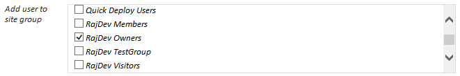
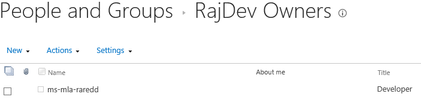
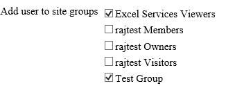

# Pattern: Add or remove user from site groups #
This pattern is used for adding or removing user from the Site Groups.

## InfoPath approach ##
As mentioned earlier, on form load, all the site groups corresponding to the site collection will be shown. The checked checkboxes would determine, the user is already present in the particular Site Group and vice versa.

If one wants to add a user to a particular Site Group, the corresponding checkbox should be checked. Similarly, if one wants to remove the user from the Site Group, corresponding checkbox should be unchecked.

On the click of the Save button, the user would be added to all the Site Groups that are checked and removed from the others.

## Example: ##



The code for adding user to site group  is defined in the `AddUserToSelectedSiteGroups` method:

```C#
XPathNavigator root = MainDataSource.CreateNavigator();
List<string> selectedGroups = new List<string>();
XPathNodeIterator iter = root.Select("//my:myFields/my:SiteGroups/my:SiteGroup", NamespaceManager);
string prevGroups = root.SelectSingleNode("/my:myFields/my:prevSiteGroups", NamespaceManager).Value;
string[] prevSitegroups = new string[] { };
string[] currSitegroups = new string[] { };
if (prevGroups.Length > 0)
{
	prevSitegroups = prevGroups.Split(','); // get all previously selected site groups
}
while (iter.MoveNext())
{
	string value = iter.Current.Value;
	if (value != null && value != "")
	{
		XPathNavigator siteGroups = DataSources["SiteGroupsRestService"].CreateNavigator();
		XPathNavigator nav = siteGroups.SelectSingleNode("/ns1:feed/ns1:entry/ns1:content/m:properties/ns2:Title[../ns2:Id = '" + value + "']", NamespaceManager);	
	if (!selectedGroups.Contains(nav.Value))
	  {
	    selectedGroups.Add(nav.Value);
	  }
	}
	if (selectedGroups.Count > 0)
	{
		 if (prevSitegroups.Length > 0)
		 {
		   currSitegroups = selectedGroups.ToArray();
		IEnumerable<string> deleteUserFromGroups =                                                                           prevSitegroups.Except(currSitegroups);
		IEnumerable<string> addUserToGroups = currSitegroups.Except(prevSitegroups);		
		   AddOrRemoveUserToGroup(deleteUserFromGroups, UserOpType.RemoveUser);
		   AddOrRemoveUserToGroup(addUserToGroups, UserOpType.AddUser);
		 }
		 else // Add user to site groups if there is no previously selected groups
		 {
		   AddOrRemoveUserToGroup(selectedGroups, UserOpType.AddUser);
		 }
	} // if (groups.Count > 0)
	else if (prevSitegroups.Length > 0) // if enduser unselect all options, remove user from site group 
	{
	  AddOrRemoveUserToGroup(prevSitegroups, UserOpType.RemoveUser);
	}   
} // private void AddUserToSiteGroups()
```

As a result the checkbox corresponding to Site Group “RajDev Owners” is checked, which means, the user would be added to that Site Group as shown in the below figure:


  
## Single Page Application using Knockout.js ##
As mentioned earlier, on form load, all the site groups corresponding to the site collection will be shown. If one wants to add a user to a particular Site Group, the corresponding checkbox should be checked. Similarly, if one wants to remove the user from the Site Group, corresponding checkbox should be unchecked.

On the click of the Save button, the user would be added to all the Site Groups that are checked and removed from the others.

## Example: ##


Code for adding or removing a user from site group is in the `AddUserToSelectedSiteGroups` JavaScript function inside the `EmpViewModel` JavaScript function:

```JavaScript
self.addOrRemoveUserToOrFromSiteGroups = function () {
	var addUsers = $(self.UserSiteGroups()).not(self.PreviouslySeletedSiteGroups());
	for (var i = 0; i < addUsers.length; i++)
	{
	   self.addUserToSiteGroup(addUsers[i]);
	}
	var deleteUsers =                                            $(self.PreviouslySeletedSiteGroups()).not(self.UserSiteGroups());
	for (var i = 0; i < deleteUsers.length; i++) 
    {
 	   self.removeUserFromSiteGroup(deleteUsers[i]);
	}
	return true;
}; 
```
     
As a result the user would be added to the Site Groups corresponding to the checkboxes checked as well as removed from the Site Groups which are unchecked.

In the above example, the checkbox corresponding to Site Group “Excel Services Viewers” is checked, which means, the user would be added to that Site Group as shown in the below figure:

[userAddedToSiteGroup]: images/KO/P10_UserAddedToSiteGroup.png

![][userAddedToSiteGroup]


## ASP.Net MVC approach ##
As mentioned earlier, on form load, all the site groups corresponding to the site collection will be shown. If one wants to add a user to a particular Site Group, the corresponding checkbox should be checked. Similarly, if one wants to remove the user from the Site Group, corresponding checkbox should be unchecked.

On the click of the Save button, the user would be added to all the Site Groups that are checked and removed from the others.

## Example: ##


The code to adding the user to the selected Site Group  is in the `EmployeeController` inside method `AddUserToSelectedSiteGroups`:


```C#
List<int> selectedGroups = new List<int>();
int[] newGroups = new int[] { };
int[] prevGroups = model.PreviouslySelectedSiteGroups;
foreach (SiteGroup grp in model.SiteGroups)
{
	if (grp.Checked)
	{
		selectedGroups.Add(grp.Id);
	}
}
if (selectedGroups.Count > 0)
{
	if (prevGroups != null && prevGroups.Length > 0)
	{
		newGroups = selectedGroups.ToArray();
		IEnumerable<int> deleteUserFromGroups = prevGroups.Except(newGroups);
		IEnumerable<int> addUserToGroups = newGroups.Except(prevGroups);		
		AddOrRemoveUserToGroup(deleteUserFromGroups, UserOpType.RemoveUser, clientContext, userID);
		AddOrRemoveUserToGroup(addUserToGroups, UserOpType.AddUser, clientContext, userID);
	}
	else // Add user to site groups if there is no previously selected groups
	{
		AddOrRemoveUserToGroup(selectedGroups, UserOpType.AddUser,               clientContext, userID);
	}
} // if (groups.Count > 0)
else if (prevGroups != null && prevGroups.Length > 0) // if enduser unselect all options, remove user from site group 
{
	AddOrRemoveUserToGroup(prevGroups, UserOpType.RemoveUser, clientContext, userID);
}
else if (prevGroups != null && prevGroups.Length > 0) // if enduser unselect all options, remove user from site group 
{
	AddOrRemoveUserToGroup(prevGroups, UserOpType.RemoveUser, clientContext);
}
```
    
As a result the user would be added to the Site Groups corresponding to the checkboxes checked as well as removed from the Site Groups which are unchecked.

In the above example, the checkbox corresponding to Site Group “Excel Services Viewers” is checked, which means, the user would be added to that Site Group as shown in the below figure:


![][userAddedToSiteGroup]


## ASP.Net Forms approach ##
As mentioned earlier, on form load, all the site groups corresponding to the site collection will be shown. If one wants to add a user to a particular Site Group, the corresponding checkbox should be checked. Similarly, if one wants to remove the user from the Site Group, corresponding checkbox should be unchecked.

On the click of the Save button, the user would be added to all the Site Groups that are checked and removed from the others.

## Example: ##


In `Default.aspx.cs` there the method `AddUserToSelectedSiteGroups` that implements the logic to add user to selected Site Group:

```C#
List<string> selectedGroups = new List<string>();
string[] newGroups = new string[] { };
string[] prevGroups = hdnPreviouslySelectedSiteGroups.Value.Split(new   char[] { ',' }, StringSplitOptions.RemoveEmptyEntries);
foreach (System.Web.UI.WebControls.ListItem grp in cblSiteGroups.Items)
{
	if (grp.Selected)
	{
		selectedGroups.Add(grp.Value);
	}
	}
	if (selectedGroups.Count > 0)
	{
		if (prevGroups != null && prevGroups.Length > 0)
		{
			newGroups = selectedGroups.ToArray();
			IEnumerable<string> deleteUserFromGroups = prevGroups.Except(newGroups);
			IEnumerable<string> addUserToGroups = newGroups.Except(prevGroups);
			AddOrRemoveUserToGroup(deleteUserFromGroups, UserOpType.RemoveUser,    clientContext);
			AddOrRemoveUserToGroup(addUserToGroups, UserOpType.AddUser, clientContext);
		}
		else // Add user to site groups if there is no previously selected groups
		{
			AddOrRemoveUserToGroup(selectedGroups, UserOpType.AddUser, clientContext);
		}
	} // if (groups.Count > 0)
	else if (prevGroups != null && prevGroups.Length > 0) // if enduser unselect all options, remove user from site group 
	{
		AddOrRemoveUserToGroup(prevGroups, UserOpType.RemoveUser, clientContext);
	}
}
```      
As a result the user would be added to the Site Groups corresponding to the checkboxes checked as well as removed from the Site Groups which are unchecked.

In the above example, the checkbox corresponding to Site Group “Excel Services Viewers” is checked, which means, the user would be added to that Site Group as shown in the below figure:

![][userAddedToSiteGroup]