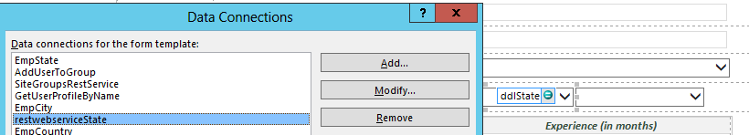
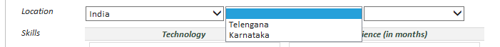
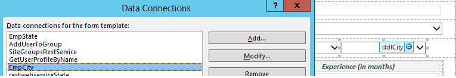
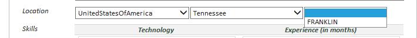
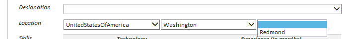
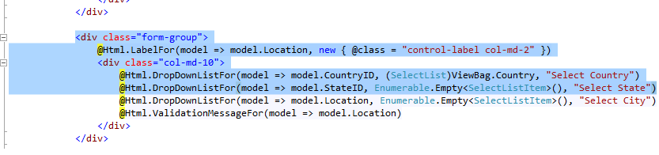
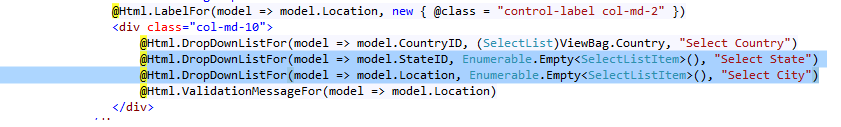
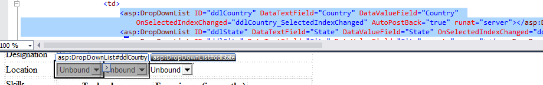
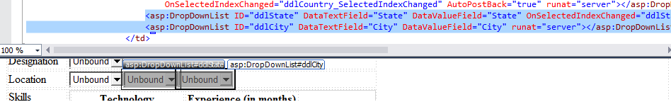

# Pattern: Cascading data load/retrieve data based on another field #
This pattern shows how populate the data in drop down list based on selection of other drop down list.  

Based on the selection of the value in the Country drop down list, the State drop down list is populated. Similarly, based on the selection of the value in the State drop down list, the City drop down list is populated.

## InfoPath approach ##
In InfoPath form, the below data connection is used to populate **State** drop down list based on selection of **Country**.



The code for setting State Drop Down List based on selection of value from Country drop down list is defined in the `ddlCountry_Changed` method:

```C#
XPathNavigator form = this.MainDataSource.CreateNavigator();
FileQueryConnection conState = (FileQueryConnection)DataConnections["restwebserviceState"];            	
string stateQuery = conState.FileLocation;
if (stateQuery.IndexOf("?") > 0)
{
	stateQuery = stateQuery.Substring(0, stateQuery.IndexOf("?"));
}
conState.FileLocation = stateQuery + "?$filter=CountryId eq " + e.NewValue + "&noredirect=true";   	
conState.Execute();
```

As a result the change in values being populated in State drop down list when the value selected in Country is changed.

  
 


Similarly, the same technique is used for filtering the SharePoint list **EmpCity** and populating the drop down list **ddlCity** based on the **State** value selected in **ddlState**; using the data connection.



The code for setting City Drop Down List based on selection of value in State drop down list, is defined in the `ddlState_Changed` method:


```C#
XPathNavigator form = this.MainDataSource.CreateNavigator();
XPathNavigator ddlstateNode = form.SelectSingleNode("/my:EmployeeForm/my:ddlState", NamespaceManager);
this.DataSources["EmpCity"].CreateNavigator().SelectSingleNode("/dfs:myFields/dfs:queryFields/q:SharePointListItem_RW/q:State", NamespaceManager).SetValue(ddlstateNode.Value);
this.DataSources["EmpCity"].QueryConnection.Execute();
```

As a result the change in values being populated in City drop down list when the value selected in State is changed.







## Single Page Application using Knockout.js ##
The **web/lists/getbytitle('"+stateListName+"')/items/?$select=Id,Title&$filter=Country/Id eq" + countryID** URL is used where in only those items of the **EmpState** SharePoint list, are retrieved, whose **Country Id** is same as that of the **ID** of value selected in the **Country** drop down list.

Population code for State Drop Down, based on Country value is in the `loadStates` JavaScript function inside the `EmpViewModel` JavaScript function:


```JavaScript
self.loadStates = function (countryID) {
	var stateListURL = _spPageContextInfo.webAbsoluteUrl + "/_api/web/lists/getbytitle('" + stateListName + "')/items/?$select=Id,Title&$filter=Country/Id eq " + countryID;
	$.ajax({
		url: stateListURL,
		type: "GET",
		headers: { "accept": "application/json;odata=verbose" },
		success: function (data) {
	      $.each(data.d.results, function (k, l) {
	      	self.States.push({ StateId: l.Id, StateName: l.Title });
	      });
	      isStatesLoaded.resolve();
		},
		error: function (error) {
		  	alert(JSON.stringify(error));
		    	isStatesLoaded.resolve();
		} 
	});
};
```

As a result the change in values being populated in State drop down list when the value selected in Country is changed.

[populatingDDLStateBasedOnDDLCountry1]: images/KO/P8_PopulatingDDLStateBasedOnDDLCountry1.png

![][populatingDDLStateBasedOnDDLCountry1]

[populatingDDLStateBasedOnDDLCountry2]: images/KO/P8_PopulatingDDLStateBasedOnDDLCountry2.png

![][populatingDDLStateBasedOnDDLCountry2]

Similarly, the **web/lists/getbytitle('"+cityListName+"')/items/?$select=Id,Title&$filter=State/Id eq" + stateID** URL is used where in only those items of the **EmpCity** SharePoint list, are retrieved, whose **State Id** is same as that of the **ID** of value selected in the **State** drop down list.

Population code for City Drop Down is in the `loadCities` JavaScript function inside the `EmpViewModel` JavaScript function:

```JavaScript
self.loadCities = function (stateID) {
	var stateListURL = _spPageContextInfo.webAbsoluteUrl + "/_api/web/lists/getbytitle('" + cityListName + "')/items/?$select=Id,Title,StateId&$filter=State/Id eq " + stateID;
	$.ajax({
		url: stateListURL,
		type: "GET",
		headers: { "accept": "application/json;odata=verbose" },
		success: function (data) {
			$.each(data.d.results, function (k, l) {
			    self.Cities.push({ CityName: l.Title });
			});
			isCitiesLoaded.resolve();
		},
		error: function (error) {
			alert(JSON.stringify(error));
			isCitiesLoaded.resolve();
	  	} 
	});
};
```

As a result the change in values being populated in City drop down list when the value selected in State is changed

[populatingDDLCityBasedOnDDLState1]: images/KO/P8_PopulatingDDLCityBasedOnDDLState1.png

![][populatingDDLCityBasedOnDDLState1]

[populatingDDLCityBasedOnDDLState2]: images/KO/P8_PopulatingDDLCityBasedOnDDLState2.png

![][populatingDDLCityBasedOnDDLState2]


## ASP.Net MVC approach ##
On **SelectedIndexChanged** event of control Country, the list items in EmpState corresponding to the value in Country are filtered using **Caml Query** and then loaded in the control that drop down list using JSON.


Population code for State Drop Down, based on Country value is in the `EmployeeController` inside method `EmpStates`:

```C#
var lstState = clientContext.Web.Lists.GetByTitle("EmpState");
CamlQuery query = new CamlQuery();
query.ViewXml = string.Format("<View><Query><Where><Eq><FieldRef Name='Country' /><Value Type='String'>{0}</Value></Eq></Where></Query></View>", selectedID);
ListItemCollection stateItems = lstState.GetItems(query);
clientContext.Load(stateItems);
clientContext.ExecuteQuery();
foreach (var item in stateItems) 
{
	stateList.Add(new SelectListItem { Text = item["Title"].ToString(), Value = item["ID"].ToString() });
}
```

For the **view** we used @Html.DropDownListFor controls to populate **State** drop down list based on value selected in **Country** drop down list. 



As a result the change in values being populated in State drop down list when the value selected in Country is changed.

![][populatingDDLStateBasedOnDDLCountry1]

![][populatingDDLStateBasedOnDDLCountry2]

Similarly, the filtering of list items happens in the **City** drop down list, after retrieval of values from SharePoint list **EmpCity**, based on the selection change event of the values in State drop down list.

Population code for City Drop Down is in the `EmployeeController` inside method `EmpCities`:

```C#
var lstCity = clientContext.Web.Lists.GetByTitle("EmpCity");
CamlQuery query = new CamlQuery();
query.ViewXml = string.Format("<View><Query><Where><Eq><FieldRef Name='State' /><Value Type='String'>{0}</Value></Eq></Where></Query></View>", selectedID);
ListItemCollection cityItems = lstCity.GetItems(query);
clientContext.Load(cityItems);
clientContext.ExecuteQuery();
foreach (var item in cityItems)
{
	cityList.Add(new SelectListItem { Text = item["Title"].ToString(), Value = item["Title"].ToString() });
}
```

For the **view** weused @Html.DropDownListFor controls to populate **City** drop down list based on value selected in **State** drop down list.



As a result the change in values being populated in City drop down list when the value selected in State is changed.

![][populatingDDLCityBasedOnDDLState1]

![][populatingDDLCityBasedOnDDLState2]

## ASP.Net Forms approach ##
In Asp .Net Forms, on SelectedIndexChanged event of control ddlCountry, the list items corresponding to the value selected in **ddlCountry** are filtered using **Caml Query** and then loaded in the control **ddlState**.


In `Default.aspx.cs` there the method `LoadStateItems` that implements the  logic of loading of values in State drop down list based on the value selected in the Country drop down list:

```C#
var lstState = web.Lists.GetByTitle("EmpState");
query.ViewXml = string.Format("<View><Query><Where><Eq><FieldRef Name='Country' /><Value Type='String'>{0}</Value></Eq></Where></Query><ViewFields><FieldRef Name='Title'/></ViewFields></View>", ddlCountry.SelectedValue);
var stateItems = lstState.GetItems(query);
clientContext.Load(stateItems);
clientContext.ExecuteQuery();
var states = from item in stateItems.ToList() select new { State = item["Title"] };
ddlState.DataSource = states;
ddlState.DataBind();
ddlState.Items.Insert(0, "--Select State--");
```
**ddlCountry** and **ddlState** drop down controls.



As a result the change in values being populated in State drop down list when the value selected in Country is changed.

![][populatingDDLStateBasedOnDDLCountry1]

![][populatingDDLStateBasedOnDDLCountry2]


Similarly, the filtering of list items happens in the **ddlCity** after retrieval of values from SharePoint list **EmpCity**, based on the selection change event of the values in **ddlState** drop down list.

In `Default.aspx.cs` there the method `LoadCityItems` that implements the loading of Cities Logic:


```C#
var lstCity = web.Lists.GetByTitle("EmpCity");
CamlQuery query = new CamlQuery();
query.ViewXml = string.Format("<View><Query><Where><Eq><FieldRef Name='State' /><Value Type='String'>{0}</Value></Eq></Where></Query><ViewFields><FieldRef Name='Title'/></ViewFields></View>", ddlState.SelectedValue);
var cityItems = lstCity.GetItems(query);
clientContext.Load(cityItems);
clientContext.ExecuteQuery();
var cities = from item in cityItems.ToList() select new { City = item["Title"] };
ddlCity.DataSource = cities;
ddlCity.DataBind();
ddlCity.Items.Insert(0, "--Select City--");
```
**ddlState** and **ddlCity** drop down controls in asp .net forms.



As a result the change in values being populated in City drop down list when the value selected in State is changed.

![][populatingDDLCityBasedOnDDLState1]

![][populatingDDLCityBasedOnDDLState2]