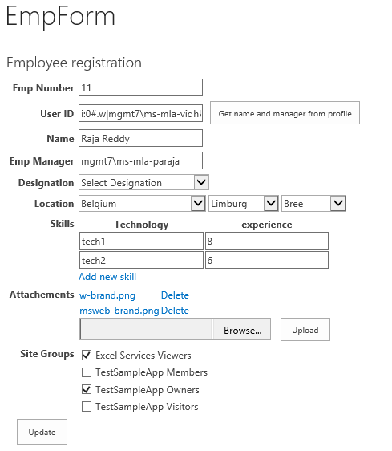
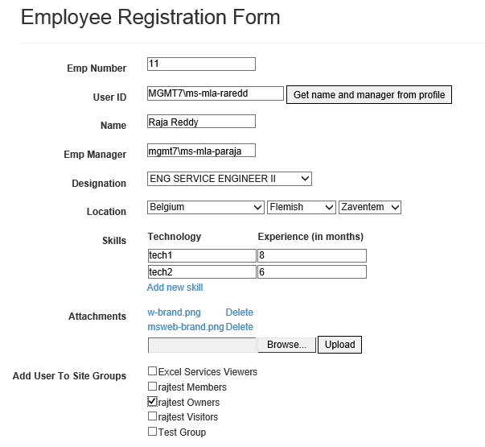
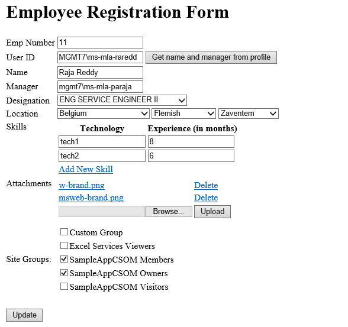

# Pattern: Load existing item in form #
This pattern shows how to programmatically load the existing item in the form.

## Single Page Application using Knockout.js ##
When the edit item is clicked, embedded `Emp-EditForm` javascript file will get the item ID of the list item and pass the list item ID to the single page app. App will fetch data of list item based on item ID and and loads data into respective form controls.

The Script code is in the `Emp-EditForm` JavaScript file

```JavaScript
JSRequest.EnsureSetup();
var displayMode = JSRequest.QueryString["DisplayMode"];

if (typeof displayMode == "undefined") {
    var itemId = JSRequest.QueryString["ID"];
    window.location = _spPageContextInfo.webAbsoluteUrl + "/SitePages/EmpForm.aspx?itemId="+itemId;
}
```

As a result, on clicking the edit item link, as shown in the below figure:

[imgEditItemIcon]: images/Common/P11_EditItem.png
![][imgEditItemIcon]

This will redirect the page to the App default page loaded with the list item, instead of the default edit item page.




## ASP.Net MVC approach ##
When the edit item is clicked, embedded ‘AppLauncher’ JavaScript file will get the item ID of the list item and pass the list item ID to the Asp .Net MVC App page. App will fetch data of list item based on item ID and loads data into respective form controls.

The Script code is in the `AppLauncher` JavaScript file

```JavaScript
var itemId = JSRequest.QueryString['ID']; 
var itemData = ""; 
if (typeof itemId != 'undefined') { 
    itemData = "%26itemId=" + itemId; 
} 
var redirectURL = "~sitecollection/_layouts/15/appredirect.aspx?client_id=&redirect_uri=%redirectURI%?{StandardTokens}" + itemData;    
window.location = redirectURL;
```

As a result, on clicking the edit item link, as shown in the below figure:

![][imgEditItemIcon]

This will redirect the page to the App default page loaded with the list item, instead of the default edit item page.




## ASP.Net Forms approach ##
When the edit item is clicked, embedded ‘AppLauncher’ JavaScript file will get the item ID of the list item and pass the list item ID to the Asp .Net forms page. App will fetch data of list item based on item ID and loads data into respective form controls

The Script code is in the `AppLauncher` JavaScript file

```JavaScript
var itemId = JSRequest.QueryString['ID']; 
var itemData = ""; 
if (typeof itemId != 'undefined') { 
    itemData = "%26itemId=" + itemId; 
} 
var redirectURL = "~sitecollection/_layouts/15/appredirect.aspx?client_id=&redirect_uri=%redirectURI%?{StandardTokens}" + itemData;    
window.location = redirectURL;
```
  
As a result, on clicking the edit item link, as shown in the below figure:

![][imgEditItemIcon]

This will redirect the page to the App default page loaded with the list item, instead of the default edit item page.


