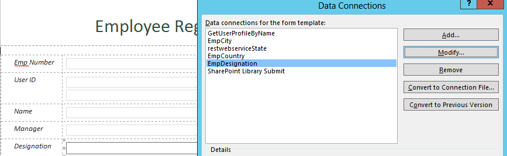
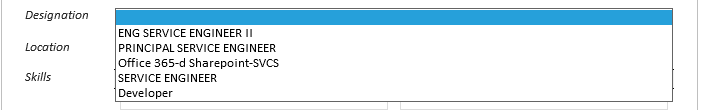
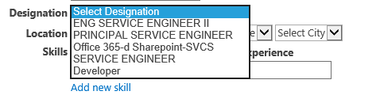
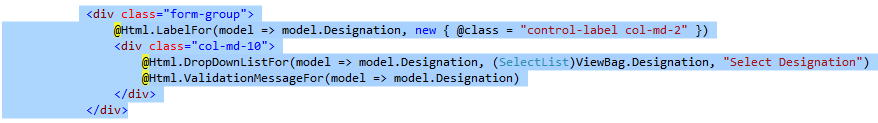
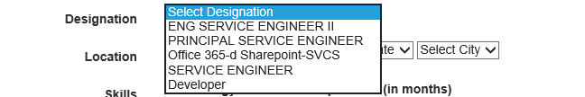
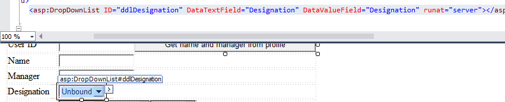

# Pattern: Populating fields on form load - read list information #
This pattern shows how to programmatically read the list information and set the values into the form control (i.e. drop down list **Designation** in this case).

## InfoPath approach ##
In InfoPath form, the data connection, **EmpDesignation** is used to populate the form control drop down list Designation, as shown in the figure below:



The code for the Loading the list data in the drop down control is defined in the `FormEvents_Loading` method:

```C#
DataConnection connection = this.DataConnections["EmpDesignation"];
connection.Execute();
```

As a result, Drop Down list Designation is populated with the values from **EmpDesignation** list.




## Single Page Application using Knockout.js ##
In knockout js form, Using the URL **/web/lists/getbytitle('"+designationListname +"')/items**, the items from the list **EmpDesignation** is retrieved and are binded to the drop down control **Designation**.

The submit code is in the `initNewFormData` JavaScript function inside the `EmpViewModel` JavaScript function:

```JavaScript
var designationListURL = siteURL + "/_api/web/lists/getbytitle('" + designationListname + "')/items";
$.ajax({
	url: designationListURL,
	type: "GET",
	headers: { "accept": "application/json;odata=verbose" },
	success: function (data) {
    $.each(data.d.results, function (k, l) {
        self.Designations.push(l.Title);
    	});
    isDesignationsLoaded.resolve();
		},
	error: function (error) {
    alert(JSON.stringify(error));
    isDesignationsLoaded.resolve();
		}
});
```

As a result, Drop down list **Designation** is populated with the values retrieved from **EmpDesignation** list.




## ASP.Net MVC approach ##
In MVC, using **Caml Query** values from list **EmpDesignation** are retrieved and are binded to the drop down MVC control **Designation**.

The submit code is in the `EmployeeController` inside method `EmployeeForm`:

```C#
List desgList = web.Lists.GetByTitle("EmpDesignation");
ListItemCollection desgItems = desgList.GetItems(CamlQuery.CreateAllItemsQuery());
List<SelectListItem> empDesgList = new List<SelectListItem>();
foreach (var item in desgItems)
   {
empDesgList.Add(new SelectListItem { Text = item["Title"].ToString())}:                          
   }
emp.Designations = new SelectList(empDesgList, "Text", "Text");
```

For the **view** we used **@Html.DropDownListFor** control to populate Designation drop down list:



As a result, list data values from **EmpDesignation** in drop down list:




## ASP.Net Forms approach ##
In web forms, using **Caml Query** values from list **EmpDesignation** are retrieved and are binded to the drop down list control **Designation**.

In `Default.aspx.cs` there the method `LoadListItems` that implements the save logic:

```C#
var lstDesignation = web.Lists.GetByTitle("EmpDesignation");
CamlQuery designationQuery = new CamlQuery();
designationQuery.ViewXml = "<FieldRef Name='Title'/>";
var designationItems = lstDesignation.GetItems(designationQuery);
clientContext.Load(designationItems);
clientContext.ExecuteQuery();
var desingations = from item in designationItems.ToList() select new { Designation = item["Title"] };
ddlDesignation.DataSource = desingations;
ddlDesignation.DataBind();
ddlDesignation.Items.Insert(0, "--Select Designation--");
```

The **ddlDesignation** drop down list field in asp.net web form:



As a result, Asp.Net web form is loaded with list values from **EmpDesignation** in drop down list Designation:


