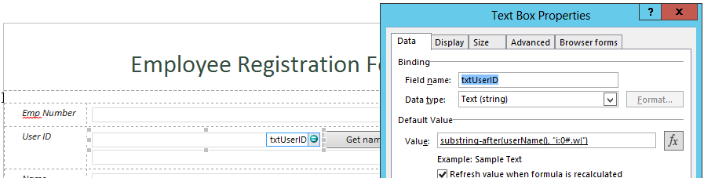
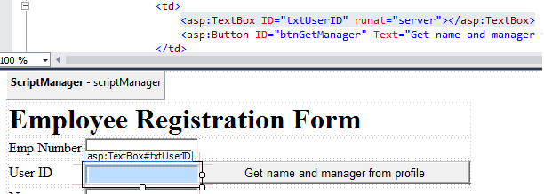

# Pattern: Populating fields on form load - set user information #
This pattern shows how to programmatically set user information on form load.

## InfoPath approach ##
In InfoPath form, using **userName**() function to get the current logged-in user name information and set the user name info to the InfoPath form element.
In this example, we are setting user info to the **txtUserID** element.

  
   

## Single Page Application using Knockout.js ##
In knockout js form, using rest api **web/currentUser** to get the current logged-in user information and setting user info to Knockout textbox field.

The submit code is in the `getCurrentUser` JavaScript function inside the `EmpViewModel` JavaScript function:

```JavaScript
self.getCurrentUser = function () {
var currentUserURL = _spPageContextInfo.webAbsoluteUrl + "/_api/web/currentUser";
$.ajax({
	url: currentUserURL,
	type: "GET",
	headers: { "accept": "application/json;odata=verbose" },
	success: function (data) {
    self.UserID(data.d.LoginName.replace('i:0#.w|', ''));
	},
	error: function (error) {
    alert(JSON.stringify(error));
				}
	});
};
```

As a result, Text box **UserID** is filled with the data from **LoginName** property of the current User, as shown in the below figure:


## ASP.Net MVC approach ##
In mvc form, using CSOM **PeopleManager** class to get the current logged-in user information and setting user info to mvc input field.

The submit code is in the `EmployeeController` inside method `EmployeeForm`:

```C#
PeopleManager peopleManager = new PeopleManager(clientContext);
PersonProperties personProperties = peopleManager.GetMyProperties();
clientContext.Load(personProperties, p => p.AccountName);                    clientContext.ExecuteQuery();    
if (personProperties != null && personProperties.AccountName != null) {
        emp.UserID = personProperties.AccountName;
}
```

For the **view** we used `@Html.TextBoxFor` control to set UserID textbox field:


As a result, MVC web form is loaded with current logged-in user information, in the **UserID** textbox control.


## ASP.Net Forms approach ##
In web form, using CSOM **PeopleManager** class to get the current user logged-in information and setting user info to textbox field.

In `Default.aspx.cs` there the method `LoadListItems` that implements the logic:

```C#
PeopleManager peopleManager = new PeopleManager(clientContext);
PersonProperties personProperties = peopleManager.GetMyProperties();
clientContext.Load(personProperties, p => p.AccountName);                    clientContext.ExecuteQuery();    
if (personProperties != null && personProperties.AccountName != null) {
        txtUserID.Text = personProperties.AccountName;
}
```

For the **Design** we used `txtUserID` Textbox field to set UserID textbox field:



As a result, Asp.Net web form is loaded with current logged-in user information in the **txtUserID**.


