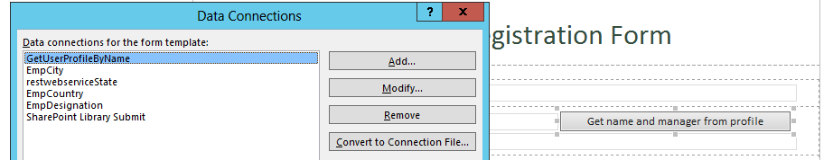
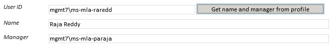
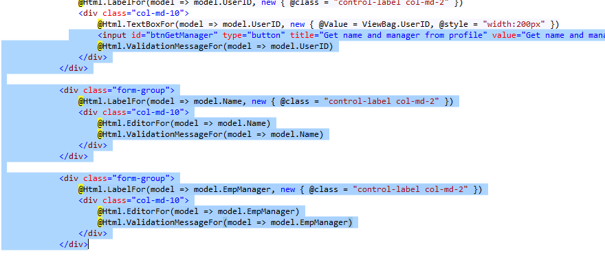
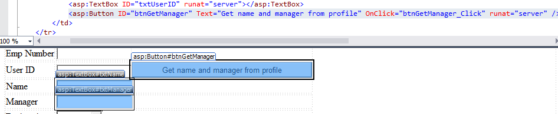

# Pattern: Retrieving user data  #
This pattern is used for retrieving the user data via code.

## InfoPath approach ##
In InfoPath form, the data connection, based on the **account name** information retrieved from the value in the text box corresponding to the field **UserID** (already set on **Form Load**), the information regarding the **Name** and **Manager** is retrieved and set into the respective text boxes in the form, using the following data connection.




The code for retrieving user data is defined in the `btnGetNameAndManager_Clicked` method:

```C#
string firstname = string.Empty;
string lastname = string.Empty;
string manager = string.Empty;
XPathNavigator form = this.MainDataSource.CreateNavigator();
form.SelectSingleNode("/my:EmployeeForm/my:txtError", NamespaceManager).SetValue("");               
string userID = form.SelectSingleNode("/my:EmployeeForm/my:txtUserID", NamespaceManager).Value;
XPathNavigator profileNav = this.DataSources["GetUserProfileByName"].CreateNavigator();
profileNav.SelectSingleNode("/dfs:myFields/dfs:queryFields/tns:GetUserProfileByName/tns:AccountName", NamespaceManager).SetValue(userID);
WebServiceConnection webServiceConnection = (WebServiceConnection)this.DataConnections["GetUserProfileByName"];
webServiceConnection.Execute();
string profileXPath = "/dfs:myFields/dfs:dataFields/tns:GetUserProfileByNameResponse/tns:GetUserProfileByNameResult/tns:PropertyData/tns:Values/tns:ValueData/tns:Value[../../../tns:Name = '{0}']";
if (profileNav.SelectSingleNode(string.Format(profileXPath, "FirstName"), NamespaceManager) != null)
  {
	firstname = profileNav.SelectSingleNode(string.Format(profileXPath, "FirstName"), NamespaceManager).Value;
  }
if (profileNav.SelectSingleNode(string.Format(profileXPath, "LastName"), NamespaceManager) != null)
  {
	lastname = profileNav.SelectSingleNode(string.Format(profileXPath, "LastName"), NamespaceManager).Value;
  }
if (profileNav.SelectSingleNode(string.Format(profileXPath, "Manager"), NamespaceManager) != null)
  {
	manager = profileNav.SelectSingleNode(string.Format(profileXPath, "Manager"), NamespaceManager).Value;
  }
string userName = string.Format("{0} {1}", firstname, lastname);                
form.SelectSingleNode("/my:EmployeeForm/my:txtName", NamespaceManager).SetValue(userName);
form.SelectSingleNode("/my:EmployeeForm/my:txtManager", NamespaceManager).SetValue(manager);
}
```

As a result **Name** and **Manager** text fields are populated with the values retrieved from the code.




## Single Page Application using Knockout.js ##
In Knockout Js forms, based on the **account name** information retrieved from the value in the text box corresponding to the field **UserID** (already set on **Form Load**), the information regarding the **Name** and **Manager** is retrieved and set into the respective text boxes.

Retrieving user data code is in the `getNameAndManagerFromProfile` JavaScript function inside the `EmpViewModel` JavaScript function:


```JavaScript
self.getNameAndManagerFromProfile = function () {
var userID = self.UserID();
var currentUserURL = _spPageContextInfo.webAbsoluteUrl + "/_api/SP.UserProfiles.PeopleManager/getpropertiesfor(@v)?@v='" + userID + "'&$select=UserProfileProperties";
$.ajax({
	url: currentUserURL,
	type: "GET",
	headers: { "accept": "application/json;odata=verbose" },
	success: function (data) {
  	var properties = data.d.UserProfileProperties.results;
  	var fN, lN;
  	properties.forEach(function (property) {
  	if (property.Key == "FirstName") {
       fN = property.Value;
     }
	if (property.Key == "LastName") {
       lN = property.Value;
     }
	if (property.Key == "Manager") {
       self.EmpManager(property.Value);
     }
   });
  self.Name(fN + " " + lN);	},
	error: function (error) {
  alert(JSON.stringify(error));
	} });
};
```

As a result **Name** and **Manager** Text fields are populated with the values retrieved from the code.


  

## ASP.Net MVC approach ##
In MVC web forms, based on the **account name** information retrieved from the value in the text box corresponding to the field **UserID** (already set on **Form Load**), the information regarding the **Name** and **Manager** is retrieved and set into the respective text boxes.

Retrieving user data code is in the `EmployeeController` inside method `GetNameAndManagerFromProfile`:

```C#
string empName = string.Empty;
string empManager = string.Empty;
SharePointContext spContext = Session["Context"] as SharePointContext;              
using (var clientContext = spContext.CreateUserClientContextForSPHost())
{
	if (clientContext != null)
    	{
    	  string[] propertyNames = { "FirstName", "LastName", "Manager" };
    	  PeopleManager peopleManager = new PeopleManager(clientContext);
		  UserProfilePropertiesForUser prop = new  UserProfilePropertiesForUser(clientContext, userID, propertyNames);
		  IEnumerable<string> profileProperty = peopleManager.GetUserProfilePropertiesFor(prop);
    	  clientContext.Load(prop);
    	  clientContext.ExecuteQuery();
    	  if (profileProperty != null && profileProperty.Count() > 0)
        {
			empName = string.Format("{0} {1}", profileProperty.ElementAt(0), profileProperty.ElementAt(1));
           	empManager = profileProperty.ElementAt(2);
        } }           
}
```

For the **view** we used @Html.TextBoxFor, input type=”text” controls to get the values in **Name** and **Manager** fields.



As a result **Name** and **Manager** Text fields are populated with the values retrieved from the code.


## ASP.Net Forms approach ##
In Asp .Net web forms, based on the **account name** information retrieved from the value in the text box corresponding to the field **UserID** (already set on **Form Load**), the information regarding the **Name** and **Manager** is retrieved and set into the respective text boxes.

In `Default.aspx.cs` there the method `btnGetManager_Click` that the logic to retrieve the user data:

```C#
string[] propertyNames = { "FirstName", "LastName", "Manager" };
string accountName = txtUserID.Text;
PeopleManager peopleManager = new PeopleManager(clientContext);
UserProfilePropertiesForUser prop = new UserProfilePropertiesForUser(clientContext, accountName, propertyNames);
IEnumerable<string> profileProperty = peopleManager.GetUserProfilePropertiesFor(prop);
clientContext.Load(prop);
clientContext.ExecuteQuery();
if (profileProperty != null && profileProperty.Count() > 0)
  {
	txtName.Text = string.Format("{0} {1}", profileProperty.ElementAt(0), profileProperty.ElementAt(1));
    	txtManager.Text = profileProperty.ElementAt(2);
  }
else
  {
	string noProfileData = string.Format("No data found for user id: {0}", accountName.Replace(@"\",@"\\"));    	
	ClientScript.RegisterStartupScript(this.GetType(), "errorMessage", "alert('" + noProfileData + "');", true);
}
```

For **Design** we used **btnGetManager** button, **txtName** and **txtManager** text box fields in asp.net web form



As a result **Name** and **Manager** text fields are populated with the values retrieved from the code.

