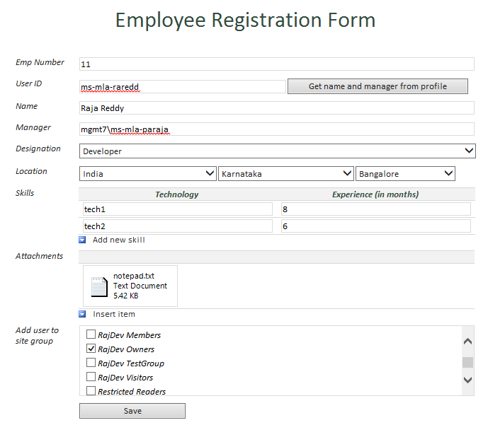
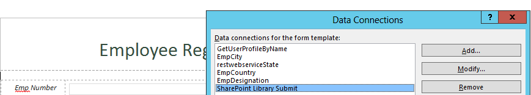
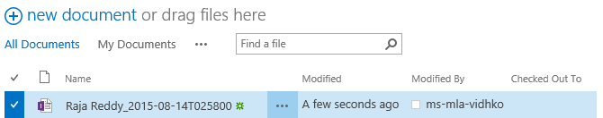
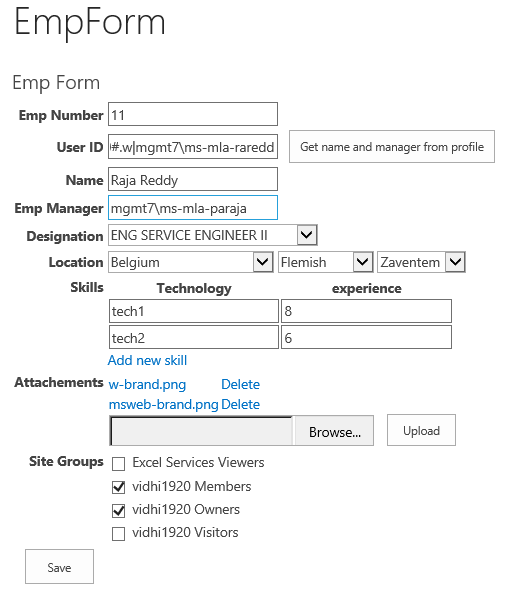
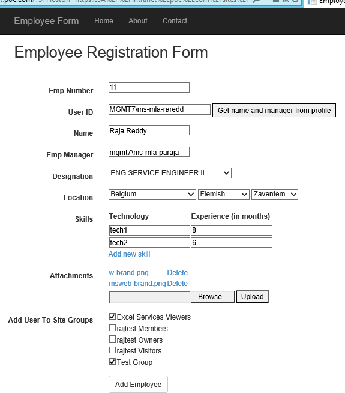
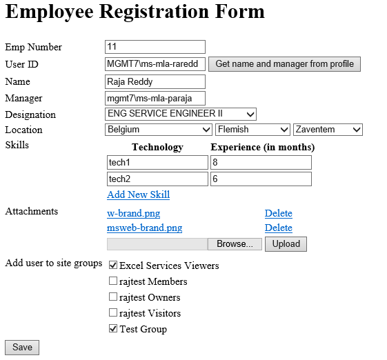

# Pattern: Submit the form via code #
This pattern shows how to programmatically submit the data entered in a form.

## InfoPath approach ##
The below figure shows the example data entered in the InfoPath form.



In InfoPath form, the data connection, **SharePoint Library Submit** is used to submit the data of the form to the list and save it as a list item.



The code for the submit is defined in the `FormEvents_Submit` method:

```C#
FileSubmitConnection conSubmit = (FileSubmitConnection)DataConnections["SharePoint Library Submit"];
conSubmit.Execute();
e.CancelableArgs.Cancel = false;
```

As result the data is saved in the Document library specified in the code. The name of the file is combined string of the **Name** Field Text and the date and time of the creation.



## Single Page Application using Knockout.js ##
The below figure shows the example data entered in the Knockout js form.



The submit code is in the `Save` JavaScript function inside the `EmpViewModel` JavaScript function:

```JavaScript
	
    self.save = function () {
    self.canSave(true);        
    var listURL =  _spPageContextInfo.webAbsoluteUrl + "/_api/web/lists/getbytitle('" + employeeListname + "')/items";
	$.ajax({
        url: listURL,
        type: "POST",
        headers: {
            "accept": "application/json;odata=verbose",
            "X-RequestDigest": $("#__REQUESTDIGEST").val(),
            "content-Type": "application/json;odata=verbose"
        },
        data: JSON.stringify(self.getEmployeeFormData()),
        success: function (data) {
                $.when(self.addOrRemoveUserToOrFromSiteGroups()).done(function () {
                    self.redirectToList();
                });
            },
        error: function (error) {
            alert(JSON.stringify(error));
        }
    });
	};

```

The result of this `Save` operation is a list item in the list as specified in the code.

[imgSavedDataAfterSubmit]: images/Common/P4_SavedDataOnSubmit.png
![][imgSavedDataAfterSubmit]

## ASP.Net MVC approach ##
The below figure shows the example data entered in the MVC form.



The submit code is in the `EmployeeController` inside method `AddEmployeeToSPList`:

```C#

	string number = model.EmpNumber;
	string name = model.Name;
	string designation = model.Designation;
	string SPHostUrl = Request.QueryString["SPHostUrl"];
	string userName = string.Empty;
	StringBuilder sbSkills = new StringBuilder();

	foreach (var skill in model.Skills)
	{
    	sbSkills.Append(skill.Technology).Append(",").Append(skill.Experience).Append(";");
	}

	var spContext = SharePointContextProvider.Current.GetSharePointContext(HttpContext);
	using (var clientContext = spContext.CreateUserClientContextForSPHost())
	{
    	if (clientContext != null)
    	{
        	var lstEmployee = clientContext.Web.Lists.GetByTitle("Employees");
        	var itemCreateInfo = new ListItemCreationInformation();
        	var listItem = lstEmployee.AddItem(itemCreateInfo);
        	listItem["EmpNumber"] = model.EmpNumber;
        	listItem["Title"] = model.Name;
        	listItem["UserID"] = model.UserID;
        	listItem["EmpManager"] = model.EmpManager;
        	listItem["Designation"] = model.Designation;
        	listItem["Location"] = model.Location;
        	listItem["Skills"] = sbSkills.ToString();
    		if (model.isFileUploaded)
            {
                listItem["AttachmentID"] = model.AttachmentID;
            }
            listItem.Update();
            clientContext.ExecuteQuery();
	        AddUserToSelectedSiteGroups(model, clientContext, model.UserID);
        }	
	}
```

For the **view** we used `input type="submit"` to trigger the save data to list:


As a result the data is saved as a list item in the list, specified in the code:

![][imgSavedDataAfterSubmit]

## ASP.Net Forms approach ##
The below figure shows the example data entered in the ASP .Net Web Form.



In `Default.aspx.cs` there the method `btnSave_Click` that implements the save logic:

```C#

	using (var clientContext = GetClientContext())
    {
        var web = GetClientContextWeb(clientContext);

        var lstEmployee = web.Lists.GetByTitle("Employees");
        var itemCreateInfo = new ListItemCreationInformation();
        var listItem = lstEmployee.AddItem(itemCreateInfo);

        listItem["EmpNumber"] = txtEmpNumber.Text;
        listItem["UserID"] = txtUserID.Text;
        listItem["Title"] = txtName.Text;
        listItem["EmpManager"] = txtManager.Text;
        listItem["Designation"] = ddlDesignation.SelectedValue;
        listItem["Location"] = ddlCity.Text;

        StringBuilder sbSkills = new StringBuilder();
        RepeaterItemCollection skills = rptSkills.Items;
        foreach (RepeaterItem skill in skills)
        {
            TextBox tbTech = (TextBox)skill.FindControl("rptTxtTechnology");
            TextBox tbSkill = (TextBox)skill.FindControl("rptTxtExperience");
            sbSkills.Append(tbTech.Text).Append(",").Append(tbSkill.Text).Append(";");
        }
        listItem["Skills"] = sbSkills.ToString();

        if (rptUploadedFiles.Items.Count > 0)
        {
            listItem["AttachmentID"] = hdnAttachmentID.Value;
        }

        listItem.Update();
        clientContext.ExecuteQuery();

        AddUserToSelectedSiteGroups(clientContext);
    }
```

The submit itself is triggered via the `btnSave` on the form:


With as result data saved as a list item in the list, specified in the code:

![][imgSavedDataAfterSubmit]


