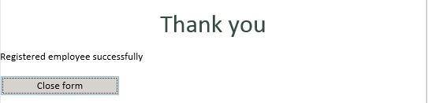
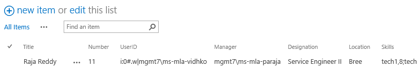
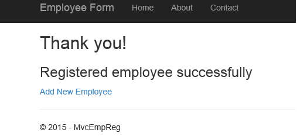
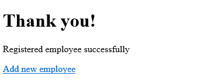

# Pattern: Switching view after form submission #
This pattern shows how to programmatically switch view after successful submission.

## InfoPath approach ##
In InfoPath form, after successful submission of data entered and saved, the view is then switched to Custom form displaying a Thank you message.

The code for the submit is defined in the `FormEvents_Submit` method:

```C#
this.ViewInfos.SwitchView("Thanks");
```

As a result, when the button **Save** is clicked, the below screen appears, provided there is no error in connection or otherwise.




## Single Page Application using Knockout.js ##
In Knockout.js, after successful submission of data entered and saved, the view is then switched to All List Items View of the SharePoint List, in which the data is saved.

The switching code is in the `Save` JavaScript function inside the `EmpViewModel` JavaScript function:

```JavaScript
success: function (data) {
    $.when(self.addOrRemoveUserToOrFromSiteGroups()).done(function () {
        self.redirectToList();
    });
}            
```
As a result, when the button **Save** is clicked, the below screen appears, provided there is no error in connection or otherwise.




## ASP.Net MVC approach ##
In MVC form, after successful submission of data entered and saved, the view is then switched to Custom form displaying a Thank you message.

The switching code is in the `EmployeeController` inside method `AddEmployeeToSPList`:

```C#
	return RedirectToAction("Thanks", new { SPHostUrl });
```

As a result, when the button **Save** is clicked, the below screen appears, provided there is no error in connection or otherwise.



## ASP.Net Forms approach ##
In ASP .Net form, after successful submission of data entered and saved, the view is then switched to Custom form displaying a Thank you message.

In `Default.aspx.cs` there the method `btnSave_Click` that implements the save logic:

```C#
	string url = HttpContext.Current.Request.Url.AbsoluteUri;
              url = url.Replace("Default.aspx", "Thanks.aspx");
   	Response.Redirect(url);
```

As a result, when the button **Save** is clicked, the below screen appears, provided there is no error in connection or otherwise.



