# Pattern: Upload or delete attachments #
This pattern is used for uploading/deleting attachment to/from Document Library.

## InfoPath approach ##
Below is the screen shot depicting the successful upload of file while saving a data in InfoPath forms:

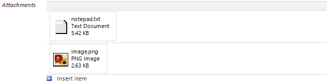

In InfoPath form, Repeating Table is used for uploading multiple files to the Document Library. 

To upload more files, the hyperlink ‘Insert Item’ is clicked, and a upload control ‘Click here to attach a file’ is added as shown in the figure:

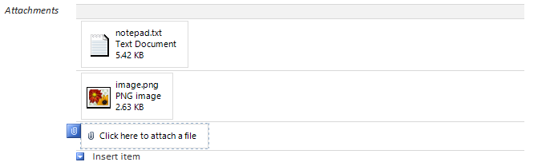

To remove any file, the in-built function ‘Remove item’ corresponding to the Repeater Table control, is being used as shown in the figure:

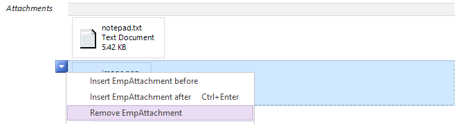

  
## Single Page Application using Knockout.js ##
Below is the screen shot depicting the successful upload of file while saving a data in InfoPath forms:

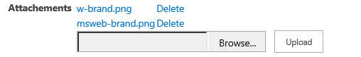

In Knockout JS, Input control of the type File, is used to upload the file to document library in SharePoint Site. Also an Attachment ID is added to the list item as a reference to the files corresponding to that list item in the document library. For more than one file uploads, same Attachment ID is saved for all the files.

## 1.	Upload Function:  ##
The attachment upload code is in the `uploadAttachment` JavaScript function inside the `EmpViewModel` JavaScript function:

```JavaScript
self.uploadAttachment = function () {
  var attachment = self.EmpAttachment();
  if (attachment === undefined) {
  alert("Please upload a file");
  return;
}
var btnForm;
// Disable submit button until file gets uploaded to SharePoint library
if (self.isNewForm()) {
  btnForm = document.getElementById('btnSave');
}
else {
  btnForm = document.getElementById('btnUpdate');
}
btnForm.disabled = true;

var libraryName = "EmpAttachments";
var file = attachment.files[0];
var fileName = file.name;
var file_name_array = fileName.split(".");
var file_extension = file_name_array[file_name_array.length - 1];
var newFileName = SP.Guid.newGuid().toString() + "." + file_extension;
var getFile = getFileBuffer(file);

getFile.done(function (arrayBuffer) {
	var uploadDocUsingRestApi = uploadDocumentInSharePointLibrary(arrayBuffer, libraryName, newFileName);
	uploadDocUsingRestApi.done(function (data, textStatus, jqXHR) {
		var uploadedDocItem = getUploadedAttachmentItemProperties(data.d);
		uploadedDocItem.done(function (data, textStatus, jqXHR) {
			var updateFileProperties = updateUploadedDocItemFields(data.d, libraryName, fileName, self.AttachmentID());
			updateFileProperties.done(function (data, textStatus, jqXHR) {
				btnForm.disabled = false;
				self.addAttachment(libraryName, newFileName, fileName);
				var inputEmpAttachment = $("#empAttachment");
				inputEmpAttachment.replaceWith(inputEmpAttachment.val('').clone(true));
				self.EmpAttachment(undefined);
			});
			updateFileProperties.fail(function (jqXHR, textStatus, errorThrown) {
				failHandler(jqXHR, textStatus, errorThrown, btnForm);
			});
		});
		uploadedDocItem.fail(function (jqXHR, textStatus, errorThrown) {
		  failHandler(jqXHR, textStatus, errorThrown, btnForm);
		});
	});
	uploadDocUsingRestApi.fail(function (jqXHR, textStatus, errorThrown) {
		  failHandler(jqXHR, textStatus, errorThrown, btnForm);
	});
}
```

As the result the attachment ID is stored in the list item. And the corresponding to that Attachment ID, files would be stored in the document library, as shown in the below figures.


[attachmentIdOfFilesUploaded]: images/KO/P9_AttachmentIdOfFilesUploaded.png

![][attachmentIdOfFilesUploaded]


[filesCorrespondingToAttachmentId]: images/KO/P9_FilesCorrespondingToAttachmentId.png

![][filesCorrespondingToAttachmentId]  


## 2.	Delete Function:  ##
For delete purpose, a link button is used in the Repeater Control which gets added on the form, after successful upload of the file to the document library.

The attachment deletion code is in the `deleteAttachment` JavaScript function inside the `EmpViewModel` JavaScript function:

```JavaScript
self.deleteAttachment = function (fileName, data, event) {
  var deleteFileUrl = _spPageContextInfo.webAbsoluteUrl + "/_api/web/getfolderbyserverrelativeurl('Lists/EmpAttachments')/files('" + fileName + "')";
  $.ajax({
    url: deleteFileUrl,
    type: "POST",
    headers: {
	    "Accept": "application/json;odata=verbose",
	    "Content-Type": "application/json;odata=verbose",
        "X-RequestDigest": $("#__REQUESTDIGEST").val(),
        "IF-MATCH": "*",
        "X-Http-Method": "DELETE"
    },
    success: function (response) {
        self.Attachments.remove(data);
    },
    error: function (error) {
        alert(JSON.stringify(error));
    }
  });
};
```

As a result the click of Delete link button, the corresponding file in the same row, will be deleted from the form as well as from the Document Library.


## ASP.Net MVC approach ##
Below is the screen shot depicting the successful upload of file while saving a data in InfoPath forms:

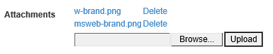


In MVC, FileUpload control is used to upload the file to document library in SharePoint Site. Also an Attachment ID is added to the list item as a reference to the files corresponding to that list item in the document library. For more than one file uploads, same Attachment ID is saved for all the files.

## 1.	Upload Function:  ##
Uploading attachment code is in the `EmployeeController` inside method `uploadAttachment`:

```C#
using (var fs = file.InputStream)
{
	FileInfo fileInfo = new FileInfo(fileName);
	newFileName = string.Format("{0}{1}", Guid.NewGuid(),         fileInfo.Extension);
	List attachmentLib = clientContext.Web.Lists.GetByTitle("EmpAttachments");
	Folder attachmentLibFolder = attachmentLib.RootFolder;
	clientContext.Load(attachmentLibFolder);
	clientContext.ExecuteQuery();
	fileRelativeUrl = String.Format("{0}/{1}", attachmentLibFolder.ServerRelativeUrl, newFileName);
    var fileCreationInformation = new FileCreationInformation();
    fileCreationInformation.ContentStream = fs;
    fileCreationInformation.Url = fileRelativeUrl;
	Microsoft.SharePoint.Client.File uploadFile = attachmentLibFolder.Files.Add(fileCreationInformation);
    uploadFile.ListItemAllFields["Title"] = fileName;
    uploadFile.ListItemAllFields["AttachmentID"] = attachmentID;
    uploadFile.ListItemAllFields.Update();
    clientContext.ExecuteQuery();                        
}
```

For the **view** we used **btnUpload** button and **empAttachment** FileUpload controls in asp.net web form.

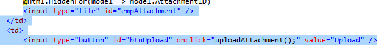

As a result the attachment ID is stored in the list item. And the corresponding to that Attachment ID, files would be stored in the document library, as shown in the below figures.

![][attachmentIdOfFilesUploaded]

![][filesCorrespondingToAttachmentId]  


## 2.	Delete Function:  ##
For delete purpose, a link button is used in the Repeater Control which gets added on the form, after successful upload of the file to the document library.

Delete attachment code is in the `EmployeeController` inside method `DeleteAttachment`:

```C#
Microsoft.SharePoint.Client.File fileToDelete = clientContext.Web.GetFileByServerRelativeUrl(fileRelativeUrl);
clientContext.Load(fileToDelete);
fileToDelete.DeleteObject();
clientContext.ExecuteQuery();
```

For the **view** we used Delete Attachment controls in asp.net web form.

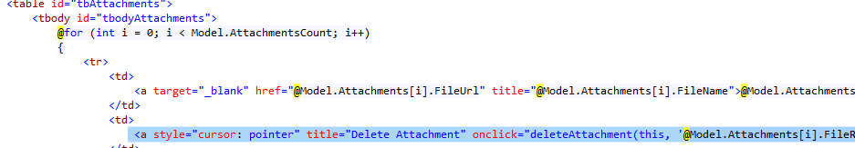

As a result on the click of Delete link button, the corresponding file in the same row, will be deleted from the form as well as from the Document Library.

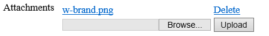

## ASP.Net Forms approach ##
Below is the screen shot depicting the successful upload of file while saving a data in InfoPath forms:
 


In Asp .Net web forms, FileUpload control is used to upload the file to document library in SharePoint Site. Also an Attachment ID is added to the list item as a reference to the files corresponding to that list item in the document library. For more than one file uploads, same Attachment ID is saved for all the files.

## 1.	Upload Function: ##
In `Default.aspx.cs` there the method `btnUpload_Click` that implements the attachment upload logic:


```C#
string fileName = empAttachment.FileName;
string newFileName = string.Empty;
string fileRelativeUrl = string.Empty;
using (var clientContext = GetClientContext())
{
 if (clientContext != null)
  {
	using (var fs = empAttachment.FileContent)
	{
		FileInfo fileInfo = new FileInfo(fileName);
		newFileName = string.Format("{0}{1}", Guid.NewGuid(), fileInfo.Extension);		
		List attachmentLib = clientContext.Web.Lists.GetByTitle("EmpAttachments");
		Folder attachmentLibFolder = attachmentLib.RootFolder;
		clientContext.Load(attachmentLibFolder);
		clientContext.ExecuteQuery();
		fileRelativeUrl = String.Format("{0}/{1}",     attachmentLibFolder.ServerRelativeUrl, newFileName);		
		var fileCreationInformation = new FileCreationInformation();
		fileCreationInformation.ContentStream = fs;
		fileCreationInformation.Url = fileRelativeUrl;		
		Microsoft.SharePoint.Client.File uploadFile = attachmentLibFolder.Files.Add(fileCreationInformation);
		uploadFile.ListItemAllFields["Title"] = fileName;
		uploadFile.ListItemAllFields["AttachmentID"] = hdnAttachmentID.Value;
		uploadFile.ListItemAllFields.Update();
		clientContext.ExecuteQuery();		
		string fileURl = Request.QueryString["SPHostUrl"] + "/EmpAttachments/" + newFileName;
		DataTable tblAattachments = GetAttachmentsFromRepeaterControl();
		tblAattachments.Rows.Add(fileName, fileURl, fileRelativeUrl);
		rptUploadedFiles.DataSource = tblAattachments;
		rptUploadedFiles.DataBind();
    }
}
```

In Design we used **btnUpload** button and **empAttachment** FileUpload controls in asp.net web form.

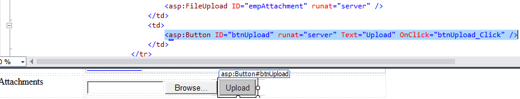


As a result the attachment ID is stored in the list item. And the corresponding to that Attachment ID, files would be stored in the document library, as shown in the below figures.

![][attachmentIdOfFilesUploaded]

![][filesCorrespondingToAttachmentId]

## 2.	Delete Function:  ##
For delete purpose, a link button is used in the Repeater Control which gets added on the form, after successful upload of the file to the document library.

In `Default.aspx.cs` there the method `lnkbtnDelete_Click` that implements the attachment deletion logic:

```C#
LinkButton lnkDelete = (LinkButton)sender;
if (lnkDelete != null)
{
	int deleteAttachmentIndex = ((RepeaterItem)lnkDelete.NamingContainer).ItemIndex;
	string fileRelativeUrl = lnkDelete.CommandArgument.ToString();
	using (var clientContext = GetClientContext())
	{
	  if (clientContext != null)
	  {
		Microsoft.SharePoint.Client.File fileToDelete = clientContext.Web.GetFileByServerRelativeUrl(fileRelativeUrl);
    	clientContext.Load(fileToDelete);
    	fileToDelete.DeleteObject();
    	clientContext.ExecuteQuery();
    	DataTable tblAattachments = GetAttachmentsFromRepeaterControl();
    	tblAattachments.Rows[deleteAttachmentIndex].Delete();
    	rptUploadedFiles.DataSource = tblAattachments;
    	rptUploadedFiles.DataBind();
	  } 
   }
}
```

For design we used **rptDelete** link button and **rptUploadedFiles** Repeater controls in asp.net web form.

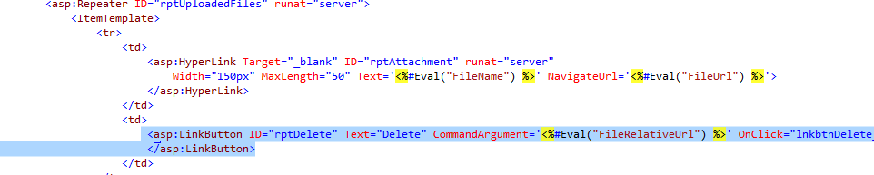

As a result on the click of Delete link button, the corresponding file in the same row, will be deleted from the form as well as from the Document Library.

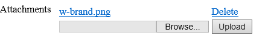
