# InfoPath Form RPC Data Connection Remediation #

### Summary ###
This InfoPath Form RPC Data Connection Remediation application shows how to replace a legacy RPC-based InfoPath data connection with a SharePoint List data connection or an alternative implementation.

### Applies to ###
-  SharePoint Online

### Solution ###
Solution | Author(s)
---------|----------
InfoPath Form RPC Data Connection Remediation | Ron Tielke, Bert Jansen (**Microsoft**)

### Version history ###
Version  | Date | Comments
---------| -----| --------
1.0  | December 13th 2016 | Initial release

### Disclaimer ###
**THIS CODE IS PROVIDED *AS IS* WITHOUT WARRANTY OF ANY KIND, EITHER EXPRESS OR IMPLIED, INCLUDING ANY IMPLIED WARRANTIES OF FITNESS FOR A PARTICULAR PURPOSE, MERCHANTABILITY, OR NON-INFRINGEMENT.**

----------

# Introduction #
The purpose of this document is to provide guidance for updating an InfoPath Form Template to replace a legacy RPC-based InfoPath data connection with a SharePoint List data connection, an alternative implementation that is supported in both SharePoint Online (SPO) Multi-tenant (MT) and Dedicated vNext (DvNext) environments.  

An RPC-based data connection is an Xml Data Connection that leverages the following server-side endpoint:

- http://Server_Name/[sites/][Site_Name/]_vti_bin/`owssvr.dll`

### Issue To Remediate ###

The URLs associated with a legacy RPC Data Connection (embedded or UDCX-based) generally have the following format `(see: https://msdn.microsoft.com/en-us/library/office/ms448359.aspx)`

- http://Server_Name/[sites/][Site_Name/]_vti_bin/owssvr.dll?Cmd=Display&List={guid}&XMLDATA=TRUE
- http://Server_Name/[sites/][Site_Name/]_vti_bin/owssvr.dll?Cmd=Display&List={guid}&View={guid}&XMLDATA=TRUE
- http://Server_Name/[sites/][Site_Name/]_vti_bin/owssvr.dll?Cmd=Display&List={guid}&XMLDATA=TRUE&FilterField1=<name>&FilterFieldValue1=<value>

For Browser-enabled InfoPath forms, calls to these URLs are executed by InfoPath Form Services, a server-side process that resides on the SharePoint Web Front End server.  In effect, server is calling itself.  

- In environments where Loopback Protection is disabled (e.g., on-prem farms, SPO-Dedicated farms), the call executes without issue.
- In cases where Loopback Protection is enabled (e.g., SPO-MT or SPO-DvNext), the call fails.

For the form to operate as expected in SharePoint Online MT (and DvNext) environments, all RPC-based data connections must be removed from the form.  If similar functionality is needed, it should be replaced with an alternative implementation that is supported in SharePoint Online (MT and vNext)

## Remediation Process ##

The following section outlines the general process of remediation.

### Edit the Form Template ###

#### Add a New Data Connection to the Form (see appendix for screenshots) ####

- Leverage an existing data connection file if one already exists; otherwise,
- Create a new SPListDataConnection to receive data from a list
- Specify the target list
- Select one or more those fields to include in the result set
	- to improve performance, select only those that are needed/used by the form
- Convert the data connection to leverage a server-relative data connection (UDCX) file

#### Use the New Data Connection in the Form (see appendix for screenshots) ####

- Trigger the data connection as needed (onOpen or onClick)
- if filtering is required (e.g., return only those list items where **Title** equals ‘Sample’)
	- update the ruleset to insert one or more "Set a Field's Value" rules to configure the queryFields of the data connection
- Update the form to consume the dataFields of the new result schema format as needed
	- bind controls to the result set as needed
	- AND/OR
	- use rules to set field values as needed
- Remove the legacy RPC XmlDataConnection from the form
- Republish the Form Template

## Appendix ##

### Sample Form ###

The following form serves as a sample to demonstrate this concept.

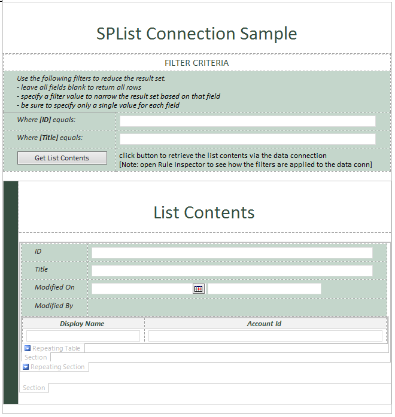 

### Form Schema ###

The form has the following fields to support filtering criteria.

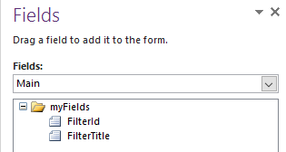

The form leverages a SharePoint List Data Connection that returns the following schema.

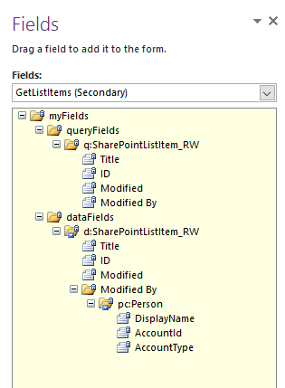

### Form Rules ###

The form applies the following ruleset when the button is clicked

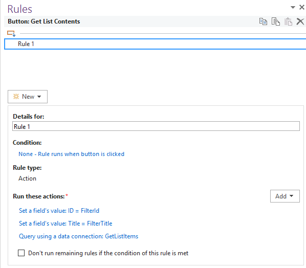

### Create a SharePoint List Data Connection: ###

Leverage an existing data connection file if one already exists.

Otherwise, create a connection to receive data from a list

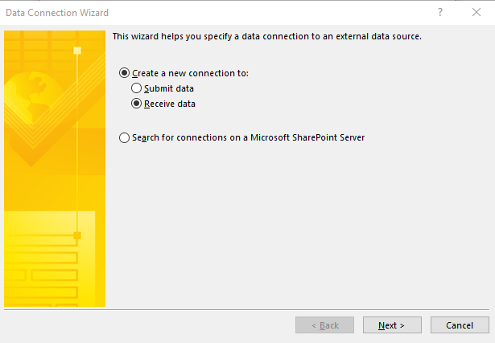

Choose a SharePoint Library/List connection

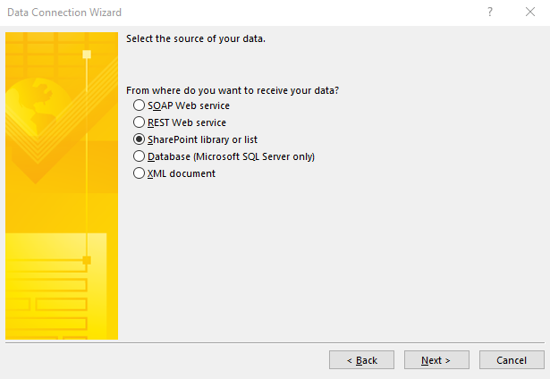

Specify the target list

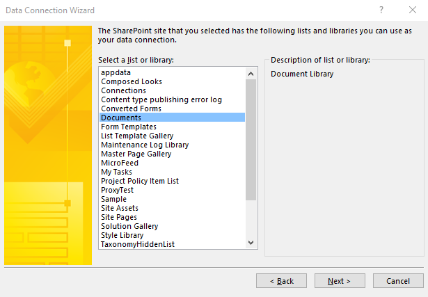

Select one or more those fields to include in the result set

- to improve performance, select only those that are needed/used by the form

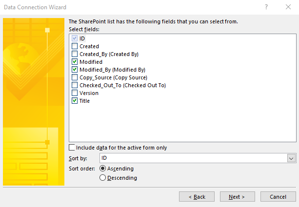

Name the connection and choose whether to auto-execute when the form opens

Convert the data connection to leverage a server-relative data connection (UDCX) file]

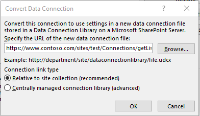

### Create Rules to Filter/Execute the Data Connection ###

Add a rule to establish a filter value for the **ID** field of the queryFields

Add a rule to establish a filter value for the **Title** field of the queryFields

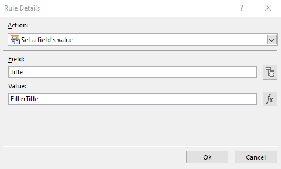

Add a rule to execute the data connection

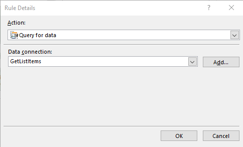

