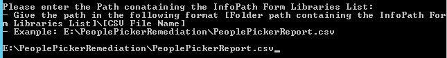
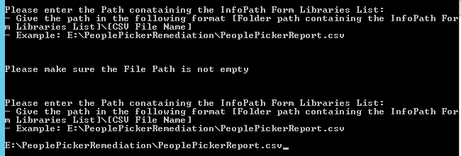

# InfoPath People Picker Data Fix #

### Summary ###
This is a client-side Console application that reads input .csv file and it connects to the SharePoint sites listed in .csv file. In every SharePoint site, it will parse all xml/list items of provided InfoPath form library and fix people picker data if necessary. A status report .csv file will be generated at the end of the application, which will show status of people picker data fix of every xml/list item in InfoPath form library of every site. 

### Applies to ###
-  Office 365
-  SharePoint 2013/2016 on-premises


### Solution ###
Solution | Author(s)
---------|----------
PeoplePickerRemediation.Console | Raja Shekar Bhumireddy(**Infosys**), Bert Jansen (**Microsoft**)

### Version history ###
Version  | Date | Comments
---------| -----| --------
1.0  | March 15th 2016 | Initial release

### Disclaimer ###
**THIS CODE IS PROVIDED *AS IS* WITHOUT WARRANTY OF ANY KIND, EITHER EXPRESS OR IMPLIED, INCLUDING ANY IMPLIED WARRANTIES OF FITNESS FOR A PARTICULAR PURPOSE, MERCHANTABILITY, OR NON-INFRINGEMENT.**


----------

# Introduction#
This is a client-side Console application that reads input .csv file and it connects to the SharePoint sites listed in .csv file. In every SharePoint site, it will parse all xml/list items of provided InfoPath form library and fix people picker data if necessary. A status report .csv file will be generated at the end of the application, which will show status of people picker data fix of every xml/list item in InfoPath form library of every site.  

# Usage #
## Authentication ##

### App-Only authentication
Specify that you want to use app-only in the configuration file like shown below:

```XML
<appSettings>
    <!-- Set to "true" if you wish to use App-only authentication -->
    <!-- Set to "false" if you wish to use User authentication -->
    <add key="UseAppModel" value="true" />

    <!-- Configure the following Client keys if you wish to use App Registration Mode -->
    <!--
    Minimum App Permissions required on target site collection that hosts the InfoPath form:
    <AppPermissionRequests AllowAppOnlyPolicy="true">
      <AppPermissionRequest Scope="http://sharepoint/content/tenant" Right="FullControl" />
    </AppPermissionRequests>

    <add key="ClientId" value="obtain from AppRegNew.aspx" />
    <add key="ClientSecret" value="obtain from AppRegNew.aspx" />
    -->
    <add key="ClientId" value="your client id" />
    <add key="ClientSecret" value="your client secret" />
</appSettings>
```

### Credentials authentication
The console will prompt the user for an administration account.  
Be sure to specify an account that has Admin permissions on the target SharePoint environment.  This account will be used to generate Authenticated User Context instances that will be leveraged to access the target environments.
- If you wish to target an SPO-D (or On-Prem) farm: 
    - use the <domain>\<alias> format for the administrator account
- If you wish to target an SPO-MT (or vNext) farm:
    - use the <alias>@<domain>.com format for the administrator account

Example is shown in the below screen shot:


## Processing Libraries with Associated Workflows and/or Event Receivers ##
Updating files in these types of libraries will trigger event receivers and workflows, which might lead to unexpected side effects.
By default, the utility will ignore these libraries.
Specify how you wish to handle Form Libraries that have associated Workflows and/or Event Receivers as follows:

```XML
<appSettings>
    <!-- 
    Note: A library with both EventReceivers and Workflows will be processed ONLY if BOTH of the following values are set to "Yes"
    <add key="UpdateUserInfoEvenIfEventReceiversEnabled" value="??" />
      Yes - process the library even if it has an associated event receiver (note: this will result in associated event receivers being executed)
      No  - skip the library if it has an associatedevent receiver
    <add key="UpdateUserInfoEvenIfWorkflowsEnabled" value="??" />
      Yes - process the library even if it has an associated workflow (note: this will result in associated Workflows being started)
      No  - skip the library if it has an associated workflow
    -->
    <add key="UpdateUserInfoEvenIfEventReceiversEnabled" value="No" />
    <add key="UpdateUserInfoEvenIfWorkflowsEnabled" value="No" />
</appSettings>
```

### Recommendations ###
- Execute a first pass of this utility across all of your form libraries, leaving these values set to "No". 
- Review the resulting log file(s) and identify those libraries that were skipped.
- Evaluate the workflows and/or event receivers of those libraries.
- Determine if it is safe to trigger those workflows and/or event receivers.
- Mitigate the effects of those workflows and/or event receivers by disabling or removing them as needed.
- Execute a second pass on those libraries, setting these values to "Yes" as necessary.

## Other Inputs to be provided on Command prompt ##
The console will also prompt the user for the input file path.

Be sure to specify the input file path in the following format:
- If you wish to target an SPO-D (or On-Prem) farm: 
    - use the <folder path containing the file>\<csv file name> format for the input file path
- Example: 
    - One such example is as shown in the figure: 



**Note:**
If the path entered is incorrect or the file doesn’t exist, or nothing is entered, then respective error message is shown and it will again prompt for the file path. This can be shown in the below figure:



## Operation – PeoplePickerRemediation ##
This operation reads data from an input file and iterates through each row and connects to corresponding site collection. It reads all xml/list items of provided InfoPath form library and validates the people picker control’s user information (domain\user). It finds the UPN value for the listed user by querying the local AD environment and replace the On-Prem user id with new UPN value (alias@domain).  
Also it generates status report of people picker data fix of every xml/list item in InfoPath form library of every site.


### Input - PeoplePickerReport.csv ###

This is a CSV that follows in which the header row is at least expected with the following format and columns: WebUrl, ListName:

- **WebUrl**: This column should contain the Url of the SharePoint Web
- **ListName**: This column should contain the InfoPath form’s list name

See [PeoplePickerReport.csv](/InfoPath/Migration/PeoplePickerRemediation.Console/PeoplePickerReport.csv) for a report sample.

**Note:**
You can also take the output from the 06_Parse-InfoPathPeoplePickerReport script in the scanning folder and use the GeneratePeoplePickerCSOMInput.ps1 script to transform that in a valid format for this tool. Keep in mind though that a manual validation of the data input is still required!

### Output - PeoplePickerDataFix_dd_mm_yyyy_hh_mm_ss.csv ###
A status report .csv file is generated at the end of the application, which will show status of InfoPath forms people picker data fix. 

This CSV that follows the header format and columns as mentioned below: WebUrl, ListName, ItemID, Users, Groups, Status, ErrorDetails:

- **WebUrl**: This column should contain the Url of the SharePoint Web
- **ListName**: This column should contain the InfoPath form’s list name
- **ItemID**: This column contains the ID of the InfoPath form library list item.
- **Users**: This column contains the list of the On-Prem user ids and their corresponding UPN values.
- **Groups**: This column contains the list of available groups in InfoPath form.
- **Status**: This column contains the Status of fixing the people picker data of InfoPath form which will be either ‘Success’ or ‘Error’ or ‘NoupdateRequired'
- **ErrorDetails**: This column contains Error Details or Message if any issue while fixing the people picker data. On the success of the same, the corresponding data would be blank.

See [PeoplePickerDataFix_14_03_2016_12_26_50.csv](/InfoPath/Migration/PeoplePickerRemediation.Console/PeoplePickerDataFix_14_03_2016_12_26_50.csv) for an status report sample.

 


