# JDP.Remediation.Console #

### Summary ###
This sample demonstrates the JDP Remediation Console, which is a CSOM-based Windows Console application that can assist an overall effort to remove Farm Solution-based customizations and components from a SharePoint farm.  It allows the user to perform operations from the following general categories:

-  **Transformation**
	- Transform site collections to remove and/or replace various Farm Solution-based customizations and components within the target SharePoint farm prior to Farm Solution retraction
-  **Clean-up**
	- Remove various Farm Solution-based customizations and components that have been left behind (i.e., orphaned) within the target SharePoint farm after Farm Solution retraction
-  **Self-Service Reporting** 
	- Generate various reports to locate Farm Solution-based customizations and components within the target SharePoint farm

### Applies to ###
-  Office 365 Dedicated (D)
-  SharePoint 2013 on-premises

### Solution ###
Solution | Author(s)
---------|----------
JDP Remediation - CSOM | Ron Tielke (**Microsoft**), Infosys Ltd

### Version history ###
Version  | Date | Comments
---------| -----| --------
1.0  | January 29th 2016 | Initial release

### Disclaimer ###
**THIS CODE IS PROVIDED *AS IS* WITHOUT WARRANTY OF ANY KIND, EITHER EXPRESS OR IMPLIED, INCLUDING ANY IMPLIED WARRANTIES OF FITNESS FOR A PARTICULAR PURPOSE, MERCHANTABILITY, OR NON-INFRINGEMENT.**

----------

## Introduction ##
This is a client-side Console application that leverages the v15 CSOM client SDKs to perform operations against a remote SPO-D 2013 farm.
The primary purpose of this tool is to allow a customer to remediate issues identified by the various reports of the MSO Pre-Migration Scan.  Feel free to extend the console to include additional operations as needed.

## Scope ##
This console application is intended to work against SPO-D 2013 (v15) target environments.  
It has not been tested against SPO-vNext 2013 (v16) target environments.

## Authentication ##
The console will prompt the user for an administration account.  
Be sure to specify an account that has Admin permissions on the target SharePoint environment.  This account will be used to generate Authenticated User Context instances that will be leveraged to access the target environments.  

- If you wish to target an **SPO-D (or On-Prem)** farm:
  *  use the **<domain\>\<alias\>** format for the administrator account.
- If you wish to target an **SPO-MT (or vNext)** farm:
  *  use the **<alias\>@<domain\>.com** format for the administrator account.

## Performance ##
The utility will perform its best when using a client machine that has 8GB RAM and a reliable internet connection with ample bandwidth.  

The utility is currently implemented as a single-threaded application.  As such, it will process the specified input file in a serial fashion, one line at a time.  It can take several hours to process large input files (10,000 rows or more). 
 
In these cases, the easiest and fastest way to improve performance is to partition the input file into smaller files and use multiple instances of the utility (running either on the same machine, or on multiple machines) to process each partition.

## Commands ##
This sample demonstrates the JDP Remediation Console, which is a CSOM-based Windows Console application that can assist an overall effort to remove Farm Solution-based customizations and components from a SharePoint farm.  It allows the user to perform operations from the following general categories:

	1. Transformation  
	2. Clean-Up  
	3. Self Service Report 
	4. Exit  

The same are shown in the screen-shot below:

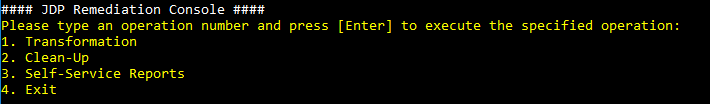

-  **Transformation**
	- Transform site collections to remove and/or replace various Farm Solution-based customizations and components within the target SharePoint farm prior to Farm Solution retraction
-  **Clean-up**
	- Remove various Farm Solution-based customizations and components that have been left behind (i.e., orphaned) within the target SharePoint farm after Farm Solution retraction
-  **Self-Service Reporting** 
	- Generate various reports to locate Farm Solution-based customizations and components within the target SharePoint farm
	
When you start this application, you are prompted to provide Admin account credentials (***User Name*** and ***Password***)

You would need to provide some inputs to execute this console application to get your desired results. Simply select the category of the operation you want to perform.

**Examples**:

- To execute `"Clean-Up"` operations, enter **2**.
- To `"Exit"` the application, enter **4**.

## 1 - Transformation ##

On selecting **1st Choice of Operation**, we get the following operations as shown in the below screen-shot:

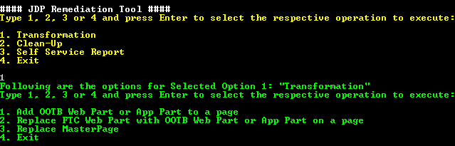 

These operations are listed and explained as below:

### 1. Add OOTB Web Part or App Part to a page ###

This operation adds a specified WebPart (OOTB or AppPart) to a specified page present in the specified web site.  
> **Note**: Web Part should be present in the Web Part Gallery.
 
**Input**

This operation does not use an input file; instead, it prompts the user for the following parameters: 

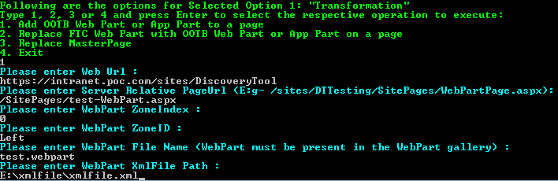 

- **Web Url**
	* Here we need to provide the `Web Url` where we need to add the WebPart  
	**Example:**    “https://intranet.campoc.com/sites/OffshorePoc"
- **Server Relative PageUrl:**
	* Here we need to provide the `server relative url of the page` in Web Url where we need to add the WebPart  
	**Example:**    “/sites/OffshorePoc/SitePages/DevHome.aspx”
- **WebPart ZoneIndex:**
	* Here we need to provide the `zone index` of the web part we need to add  
	**Example:**    “0"
- **WebPart ZoneID:**
	* Here we need to provide the `zone id` of the web part we need to add  
	**Example:**    “LeftColumnZone"
- **WebPart File Name**
	* Here we need to provide the `WebPart Name` which we need to add.  
	**Example:** webPartName.webpart
- **WebPart XmlFile Path:**
	* Here we need to provide the `Xmlfile path of the web part` we need to add  
	**Example:** “E:\ProjectTest\Configured_5a170911-91dd-4643-adb6-289565f12867_TargetContentQuery.xml”

> **Note:** This webpart should be present in the WebPart Gallery of the given WebUrl

**Output**

- **AddWebPart-yyyyMMdd_hhmmss.log**
  * This is the verbose log file of the scan.
  * Success messages of interest:
      * SUCCESS: Added File: {0}
  * Informational messages of interest:
      * None
  * Error messages of interest:
      * Error=File Not Found
          * Cause: The specified file or folder does not exist
          * Remediation: none; the file is gone
      * Error=The file is checked out for editing
          * Cause: someone has checked out the file for editing
          * Remediation: 
              * Visit the site containing the locked file
              * Undo the check-out
              * Delete the locked file
      * (404) Not Found
          * Cause: The specified site collection does not exist
          * Remediation: none; the site collection does not exist
      * Cannot contact site at the specified URL
          * Cause: The specified web (subweb, subsite, etc.) does not exist
          * Remediation: none; the web does not exist
- **AddWebPart\_SuccessFailure-yyyyMMdd_hhmmss.csv**
	* In this report, details of newly added web part will be present.
	* This output file would contain the below mentioned columns and the entries corresponding to webpart.
		*	**PageUrl:** Specifies the Url of the page where the web part is added.
		*	**SiteCollection:** Specifies the Site Collection where in the web part is present.
		*	**ExecutionDateTime:** Specifies the Executed Date & Time.
		*	**Status:** Specifies whether the status of adding of web part. It contains one of the following values
			*	**Success:** If value of this column is “Success” it implies that the adding of the web part was successful
			*	**Failure:** If value of this column is “Failure” it implies that the adding of the web part was not successful due to some error. 
		*	**WebApplication:** Specifies the Web Application of the Site Collection where in the web part is present.
		*	**WebPartFileName:** Specifies the web part name
		*	**WebUrl:** Specifies the Web Url for the Site Collection where in the web part is present
		*	**ZoneID:** Specifies the Zone ID of the web part
		*	**ZoneIndex:** Specifies the Zone Index of the web part

### 2. Replace FTC Web Part with OOTB Web Part or App on a page ###
This operation will read the input file from PreMT-Scan or Discovery output file for Web Parts components *(i.e. PreMT_MissingWebPart.csv or WebPartsUsage_Usage.csv respectively)*. This operation reads an input file and replaces existing WebParts (Custom) with new WebParts (OOTB or AppPart) on the specified pages.  Operationally, it deletes an existing WebPart before adding the new WebPart.  

The operation also prompts the user for the following parameters (shown in the below screenshot):

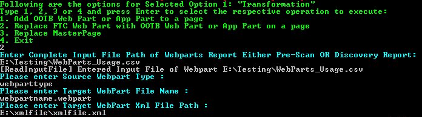 

> Before running this function, please run Generate WebPart Properties Report function (3: Self Service Report > 7: Generate WebPart Properties Report), so that the XMLs for both source and target WebParts is available, to run delete and add function.  

> **Note:** Web Part should be present in the Web Part Gallery.
 

**Input**

This operation reads **either** of the following input files:

- **PreMT_MissingWebPart.csv** `generated by the Pre-Migration scan`. 

 * A header row is expected with the following format:  
		* *WebPartId, WebPartType, PageUrl, StorageKey, ZoneID, ZoneIndex, WebUrl*

***OR***

- **WebPartsUsage_Usage.csv** `generated by the Discovery scan`. 

	* A header row is expected with the following format:
		* *WebPartId, WebPartType, PageUrl, StorageKey, ZoneID, ZoneIndex, WebUrl*

The operation also prompts the user for the following parameters:

- **Input File Path:**
	* Here we need to the file path of the above mentioned input file  
	**Example:**    “E:\WebParts_Usage.csv"
- **WebPart Type:**
	* Here we need to provide the WebPart Type which we need to be replaced  
	**Example:**    “ContentEditorWebPart”
- **Target WebPart File Name:**
	* Here we need to provide the WebPart Name which we need to replace  
	**Example:**    “ContentQuery.webpart"
- **WebPart ZoneID:**
	* Here we need to provide the zone ID of the web part we need to add  
	**Example:**    “LeftColumnZone"
- **WebPart XmlFile Path:**
	* Here we need to provide the Path of the Xml file corresponding to Web Part. This Xml you can generate by running operation - *"Generate WebPart Properties Report function" (3: Self Service Report > 7: Generate WebPart Properties Report)*  
	**Example:** “E:\ProjectTest\Configured_5a170911-91dd-4643-adb6-289565f12867_TargetContentQuery.xml”

**Output**

-	**ReplaceWebPart\_SuccessFailure-yyyyMMdd_hhmmss.csv** 
  * In this report, all the web parts replaced will be present.
  * This output file would contain the below mentioned columns and the entries corresponding to webaprts.
      * **PageUrl:** Specifies the Url of the page where the web part is replaced
      * **ExecutionDateTime:** Specifies the Executed Date & Time.
      * **WebApplication:** Specifies the Web Application of the Site Collection where in the web part is present.
      * **SiteCollection:** Specifies the Site Collection where in the web part is present.
      * **WebUrl:** Specifies the Web Url for the Site Collection where in the web part is present.
      * **Status:** Specifies whether the status of replacement of web part. It contains one of the following values
	      * Success: If value of this column is “Success” it implies that the replacement of the web part was successful
	      * Error: If value of this column is “Error” it implies that the replacement of the web part was not successful due to some error. Same error details will be mentioned in the log file as mentioned below
		* **WebPartId:** Specifies Web Part Id of the web part
		* **WebPartType:** Specifies the Web Part Type of the web part
		* **ZoneID:** Specifies the zone ID of the web part
		* **ZoneIndex:** Specifies the Zone Index of the web part  
- **ReplaceWebPart-yyyyMMdd_hhmmss.log**
	* This is the verbose log file of the scan.
  * Success messages of interest:
      * SUCCESS: Added/Deleted File: {0}
  * Informational messages of interest:
      * None
  * Error messages of interest:
      * Error=File Not Found
          * Cause: The specified file or folder does not exist
          * Remediation: none; the file is gone
      * Error=The file is checked out for editing
          * Cause: someone has checked out the file for editing
          * Remediation: 
              * Visit the site containing the locked file
              * Undo the check-out
              * Delete the locked file
      * (404) Not Found
          * Cause: : The specified site collection does not exist
          * Remediation: none; the site collection does not exist
      * Cannot contact site at the specified URL
          * Cause: The specified web (subweb, subsite, etc.) does not exist
          * Remediation: none; the web does not exist

### 3. Replace MasterPage ###

This operation reads an input file (or user input) to obtain a list of one or more WebUrls.  It then examines the Master Page settings (*Site Master Page*, *System Master Page*, or *Both*) of each web and replaces settings that reference the user-specified custom master page with settings that reference the user-specified OOTB master page.

On choosing this option, we would be asked how to proceed for this operation as shown below 

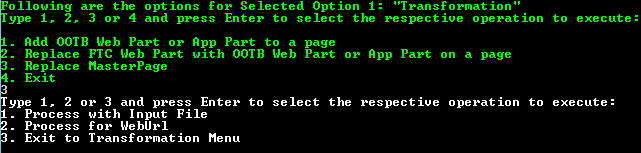

Upon choosing this option, the user is prompted for how to proceed as shown below:
  
*Please select any of following options:*

	1)	Process with Input file  
	2)	Process for Web Url

On selecting above option, console prompts to select another options as described below,

	1)	Replace MasterUrl
		Select this option if wanted to replace Master Url or System Master Page
	2)	Replace Custom MasterUrl
		Select this option if wanted to replace Custom Master Url or Site Master Page
	3)	Replace Both Master Urls   
		Select this option if wanted to replace both Master Url & Custom Master Url 

Also it asks user for input of the following parameters: 

- **Custom master page:**
	* Here we need to the file path of the above mentioned input file  
		**Example:**    “contoso.master"
- **OOTB master page:**
	* Here we need to provide the WebPart Type which we need to be replaced  
	**Example:**    “seattle.master”

**Input**

- If Option 1 `Process with Input file` is selected, this operation reads **either** of the following input files:
	- **PreMT\_MasterPage\_Usage.csv**  `(Mandatory for Option 1, not for others)`. 
This is a CSV that follows the format and content of the PreMT\_MasterPage\_Usage.csv file of the Pre-Migration scan. A header row is expected to have following columns:
		* PageUrl, SiteCollection, WebUrl, MasterUrl, CustomMasterUrl

		**OR**  

	- **MasterPage\_Usage.csv** `(Mandatory for Option 1, not for others)`. 
	This is a CSV that follows the format and content of the MasterPage_Usage.csv file of the Discovery. A header row is expected to have following columns:
		* PageUrl, SiteCollection, WebUrl, MasterUrl, CustomMasterUrl

- **Web Url** `(Mandatory for Option 2, not required for other Options)`.
	Regardless of the option selected, the operation also prompts the user for the Master Page setting(s) to replace:
	
	- The Site (aka CustomMasterUrl) Master Page only
	- The System (aka MasterUrl) Master Page only
	- Both the Site and System Master Pages
	
	As each WebUrl is processed, the operation also prompts the user for the following:
	
	- The custom Master Page file to be replaced
	- The OOTB Master Page file to use as the replacement

**Output**

- **ReplaceMasterPage-yyyyMMdd_hhmmss.log** 
	* This is the verbose log file of the scan.
  * Success messages of interest:
      * SUCCESS: Added/Replaced File: {0}
  * Informational messages of interest:
      * None
  * Error messages of interest:
      * Error=File Not Found
          * Cause: The specified file or folder does not exist
          * Remediation: none; the file is gone
      * Error=The file is checked out for editing
          * Cause: someone has checked out the file for editing
          * Remediation: 
              * Visit the site containing the locked file
              * Undo the check-out
              * Delete the locked file
      * (404) Not Found
          * Cause: : The specified site collection does not exist
          * Remediation: none; the site collection does not exist
      * Cannot contact site at the specified URL
          * Cause: The specified web (subweb, subsite, etc.) does not exist
          * Remediation: none; the web does not exist.
- **ReplaceMasterPage\_SuccessFailure-yyyyMMdd_hhmmss.csv** 
	* In this report, all the master pages replaced will be present.
	* This output file would contain the below mentioned columns and the entries corresponding to master page.
		* **CustomMasterPageUrl:** Specifies the Url of the custom master page replaced.
		* **OOTBMasterPageUrl:** Specifies the Url of the OOTB master page 
		* **WebApplication:** Specifies the Web Application of the Site Collection where in the master page is present.
		* **SiteCollection:** Specifies the Site Collection where in the master page is present.
		* **WebUrl:** Specifies the Web Url for the Site Collection where in the master page is present.
		* **ExecutionDateTime:** Specifies the Executed Date & Time.
		* **Status:** Specifies whether the status of replacement of master page. It contains one of the following values
			* **Success:** If value of this column is “Success” it implies that the replacement of the master page was successful
			* **Failure:** If value of this column is “Failure” it implies that the replacement of the master page was not successful due to some error. 

### 4. Reset Device Channel Mapping Files ###

This operation reads a list of "locked" custom master pages from an input file. It then updates the Device Channel Mappings file of the web that contains the master page file to ensure all references to the custom master page have been removed.  Each reference in the mapping file is reset to use the name of the Site Master Page currently in use on the web.

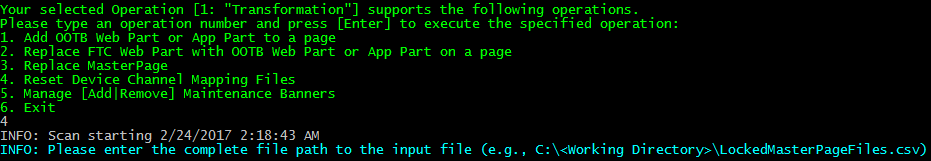

- **Note:** this operation also saves a backup of the original Mappings file.

This operation is helpful in trying to remediate the Missing Setup Files reports, especially when trying to delete custom master pages from a Master Page Gallery.  Even though all webs of the target SharePoint environment may have been reset to use OOTB master pages (e.g., seattle.master), initial attempts to delete custom master page files will often fail with the following error:

- This item cannot be deleted because it is still referenced by other pages

This error typically occurs because the Device Channel Mappings file of the web still holds a reference to the custom master page file. 

Use the **PreMT\_MissingSetupFile.csv** file generated by the Pre-Migration scan as a basis of the input file for this operation; simply copy/include only those rows that refer to master page files that cannot be deleted.

**Input**

This operation reads the following input files:
 
- LockedMasterPageFiles.csv `filtered version of PreMT_MissingSetupFile.csv file generated by the Pre-Migration scan`
	- A header row is expected with the following format: 
	- *ContentDatabase, SetupFileDirName, SetupFileExtension, SetupFileName, SetupFilePath, SiteCollection, UpgradeStatus, WebApplication, WebUrl*

**Output**

This operation generates the following output files:

- ResetDeviceChannelMappingFiles-yyyyMMdd\_hhmmss.csv
- ResetDeviceChannelMappingFiles-yyyyMMdd\_hhmmss.log (verbose log file)

### 5. Manage [Add|Remove] Maintenance Banners ###

This operation reads a list of site collection Urls from an input file and performs the specified Maintenance Banner Operation [Add or Remove] on each site collection.

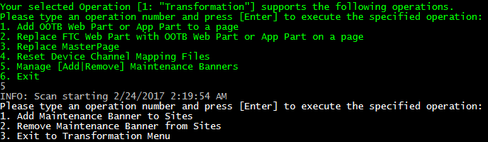

Upon choosing this option, the user is prompted for how to proceed as shown below:

	1)	Add Maintenance Banner to Sites  
	2)	Remove Maintenance Banner from Sites  
	3)	Exit to Transformation Menu

This operation is helpful in alerting site collection users to the fact that important maintenance activities are either in progress or upcoming. 

The operation leverages a centrally-managed maintenance banner message that is contained in the `embedMaintenanceBanner.js` file.  Before executing this operation, you should edit this file to specify the desired message.  Do not change the name of this file.

See [embedMaintenanceBanner.js](/JDP%20Remediation%20-%20CSOM/JDP.Remediation.Console/JDP.Remediation.Console/Scripts/embedMaintenanceBanner.js) for an example of this file. Use of this file results in a sample banner as shown below:
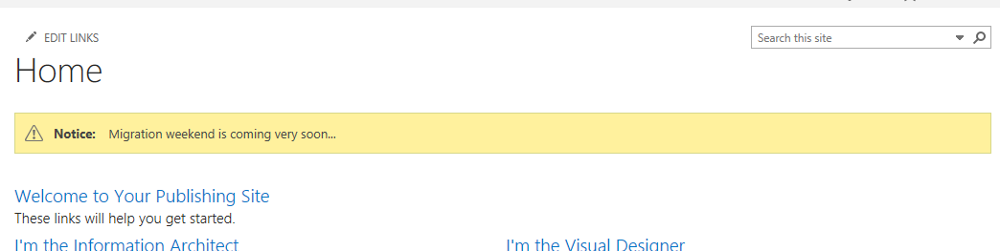 

Be sure to upload the file to a centrally-managed library, typically a folder (e.g., `scripts` or `js`) that resides beneath the `Style Library` of your root portal site.  You will be prompted for the Url of this folder if you select the **Add** operation.

**Input**

If Option 1 `Add Maintenance Banner to Sites` is selected, this operation prompts the user for the following parameters:

- CDN Library Folder Url
	- The absolute Url of the CDN Library Folder that contains the following JS file: embedMaintenanceBanner.js 
	- Example: [https://portal.contoso.com/style library/cdn/scripts](https://portal.contoso.com/style%20library/cdn/scripts)

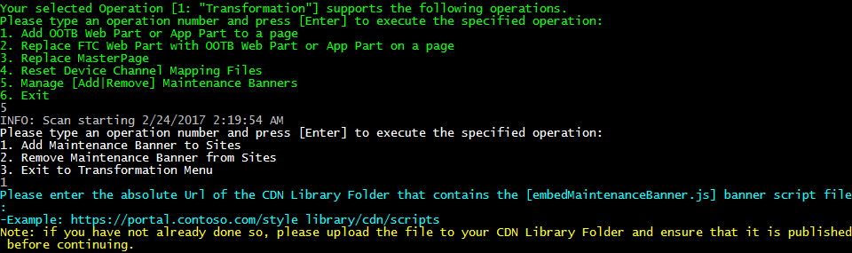 

Regardless of the option selected, the operation also reads the following input files:

- Sites.txt (no header; one fully-qualified, absolute site collection Url per line)

**Output**

This operation generates the following output files:

- ManageMaintenanceBanners-yyyyMMdd\_hhmmss.csv
- ManageMaintenanceBanners-yyyyMMdd\_hhmmss.log (verbose log file)

## 2 - Clean-Up ##

When you select the **Clean-up** category, you are presented with a list of operations as shown below:

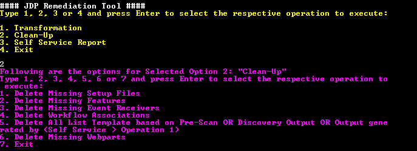 

These operations are listed below and explained in the following sections:

1. Delete Missing Setup Files  
2. Delete Missing Features  
3. Delete Missing Event Receivers  
4. Delete Workflow Associations  
5. Delete List Templates  
6. Delete Missing WebParts  
7. Exit 

### 1. Delete Missing Setup Files ###
This operation reads a list of setup file definitions from an input file and deletes the associated setup files from the target SharePoint environment.   

On selecting this Operation, we get the following options as shown in the below screenshot:

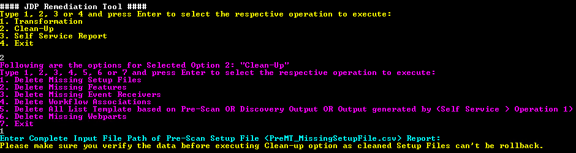 

This operation is helpful in trying to remediate the Missing Setup Files report.  It attempts to remove all specified setup files from the target SharePoint environment.

#### Input ####
- **PreMT_MissingSetupFile.csv** `generated by the Pre-Migration scan`
  * This is a CSV that follows the format and content of the PreMT_MissingSetupFile.csv file of the Pre-Migration scan. A header row is expected with the following format:
      * ContentDatabase, SetupFileDirName, SetupFileExtension, SetupFileName, SetupFilePath, SiteCollection, UpgradeStatus, WebApplication, WebUrl

#### Output ####
- **DeleteSetupFiles-yyyyMMdd_hhmmss.log**
  * This is the verbose log file of the scan.
  * Success messages of interest:
      * SUCCESS: Deleted File: {0}
  * Informational messages of interest:
      * None
  * Error messages of interest:
      * Error=File Not Found
          * Cause: The specified file or folder does not exist
          * Remediation: none; the file is gone
      * Error=Cannot remove file
          * Cause: The file is likely being used as the default Master Page of the site
          * Remediation: 
              * Use SPD to open the site containing the locked file
              * Configure **seattle.master** to be both default MPs
              * Delete the locked file
      * Error=This item cannot be deleted because it is still referenced by other pages
          * Cause: the file is being used by other pages
          * Remediation: 
              * Visit the site containing the locked file
              * Go to Site Settings and click Manage Content and Structure
                  * Or hack the URL: /_layouts/15/**siteManager**.aspx
              * Generate a References Report for the locked file
              * Remediate all references
              * Delete the locked file
      * Error=The file is checked out for editing
          * Cause: someone has checked out the file for editing
          * Remediation: 
              * Visit the site containing the locked file
              * Undo the check-out
              * Delete the locked file
      * (404) Not Found
          * Cause: : The specified site collection does not exist
          * Remediation: none; the site collection does not exist
      * Cannot contact site at the specified URL
          * Cause: The specified web (subweb, subsite, etc.) does not exist
          * Remediation: none; the web does not exist
- **DeleteSetupFiles\_SuccessFailure-yyyyMMdd_hhmmss.csv**
	* In this report, details of the deleted setup files will be present.
	* This output file would contain the below mentioned columns and the entries corresponding to deleted setup file.
		* **SetupFileDirName:** Specifies the directory of the setup file.
		* **SetupFileName:** Specifies the name of the setup file.
		* **WebApplication:** Specifies the Web Application of the Site Collection where in the setup file is present.
		* **WebUrl:** Specifies the Web Url for the Site Collection where in the setup file is present.
		* **ExecutionDateTime:** Specifies the Executed Date & Time.
		* **Status:** Specifies whether the status of deletion of setup file. It contains one of the following values
			* **Success:** If value of this column is “Success” it implies that the deletion of the setup file was successful
			* **Failure:** If value of this column is “Failure” it implies that the deletion of the setup file was not successful due to some error. 

### 2. Delete Missing Features ###
This operation reads a list of feature definitions from an input file and deletes the associated feature from the webs and sites of the target SharePoint environment.  

On selecting this Operation, we get the following options as shown in the below screenshot:

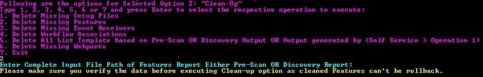 

This operation is helpful in trying to remediate the Missing Feature report.  It attempts to remove all specified features from the target SharePoint environment.

#### Input ####

This operation reads **either** of the following input files:

- **PreMT_MissingFeature.csv** `generated by the Pre-Migration scan`
	* This is a CSV that follows the format and content of the PreMT_MissingFeature.csv file of the Pre-Migration scan. A header row is expected with the following format:
    	* FeatureId, Scope, ContentDatabase, WebApplication, SiteCollection, WebUrl

	**OR**

- **Features_Usage.csv** `generated by the Discovery scan` 
	* This is a CSV that follows the format and content of the Features_Usage.csv file of the Discovery scan. A header row is expected with the following format:
    	* FeatureId, Scope, ContentDatabase, WebApplication, SiteCollection, WebUrl
    	

#### Output ####
- **DeleteFeatures-yyyyMMdd_hhmmss.log**
  * This is the verbose log file of the scan.
  * Success messages of interest:
      * SUCCESS: Deleted Feature {0} from web {1}
      * SUCCESS: Deleted Feature {0} from site {1}
  * Informational messages of interest:
      * WARNING: feature was not found in the web-scoped features; trying the site-scoped features...
      * WARNING: Could not delete Feature {0}; feature not found
      * WARNING: Could not delete Feature {0}; feature not found in site.Features
      * WARNING: Could not delete Feature {0}; feature not found in web.Features
  * Error messages of interest:
      * (404) Not Found
          * Cause: : The specified site collection does not exist
          * Remediation: none; the site collection does not exist
      * Cannot contact site at the specified URL
          * Cause: The specified web (subweb, subsite, etc.) does not exist
          * Remediation: none; the web does not exist
- **DeleteFeatures\_SuccessFailure-yyyyMMdd_hhmmss.csv**
	* In this report, details of the deleted features will be present.
	* This output file would contain the below mentioned columns and the entries corresponding to deleted features.
		* **FeatuerId:** Specifies the Id of the feature.
		* **Scope:** Specifies the scope of the feature.
		* **SiteCollection:** Specifies the Site Collection where in the feature is present.
		* **WebApplication:** Specifies the Web Application of the Site Collection where in the feature is present.
		* **WebUrl:** Specifies the Web Url for the Site Collection where in the feature is present.
		* **ExecutionDateTime:** Specifies the Executed Date & Time.
		* **Status:** Specifies whether the status of deletion of feature. It contains one of the following values
			* **Success:** If value of this column is “Success” it implies that the deletion of the feature was successful
			* **Failure:** If value of this column is “Failure” it implies that the deletion of the feature was not successful due to some error. 

### 3. Delete Missing Event Receivers ###
This operation reads a list of event receiver definitions from an input file and deletes the associated event receiver from the sites, webs, and lists of the target SharePoint environment. 

On selecting this Operation, we get the following options as shown in the below screenshot:

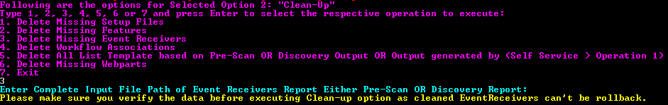 

This operation is helpful in trying to remediate the Missing Event Receiver reports.  It attempts to remove all specified event receivers from the target SharePoint environment.

#### Input ####

This operation reads **either** of the following input files:

- **PreMT_MissingEventReceiver.csv** `generated by the Pre-Migration scan`
  * This is a CSV that follows the format and content of the **PreMT_MissingEventReceiver.csv** file of the Pre-Migration scan. A header row is expected with the following format:
      * Assembly, ContentDatabase, HostId, HostType, SiteCollection, WebApplication, WebUrl

	**OR**

- **EventReceivers_Usage.csv** `generated by the Discovery scan`
  * This is a CSV that follows the format and content of the **EventReceivers_Usage.csv** file of the Discovery scan. A header row is expected with the following format:
      * Assembly, ContentDatabase, HostId, HostType, SiteCollection, WebApplication, WebUrl
      
#### Output ####
- **DeleteEventReceivers-yyyyMMdd_hhmmss.log**
  * This is the verbose log file of the scan.
  * Search the log for instances of the following significant entries:
      * SUCCESS: Deleted SITE Event Receiver [{0}] from site {1}
      * SUCCESS: Deleted WEB Event Receiver [{0}] from web {1}
      * SUCCESS: Deleted LIST Event Receiver [{0}] from list [{1}] on web {2}
  * Informational messages of interest:
      * None
  * Error messages of interest:
      * (404) Not Found
          * Cause: : The specified site collection does not exist
          * Remediation: none; the site collection does not exist
      * Cannot contact site at the specified URL
          * Cause: The specified web (subweb, subsite, etc.) does not exist
          * Remediation: none; the web does not exist
- **DeleteEventReceivers\_SuccessFailure-yyyyMMdd_hhmmss.csv**
	* In this report, details of the deleted event receivers will be present.
	* This output file would contain the below mentioned columns and the entries corresponding to deleted event receiver.
		* **Assembly:** Specifies the Assembly of the event receiver.
		* **EventName:** Specifies the name of the event receiver.
		* **HostId:** Specifies the HostId of the event receiver.
		* **HostType:** Specifies the HostType of the event receiver.
		* **SiteCollection:** Specifies the Site Collection where in the event receiver is present.
		* **WebApplication:** Specifies the Web Application of the Site Collection where in the event receiver is present.
		* **WebUrl:** Specifies the Web Url for the Site Collection where in the event receiver is present.
		* **ExecutionDateTime:** Specifies the Executed Date & Time.
		* **Status:** Specifies whether the status of deletion of event receiver. It contains one of the following values
			* **Success:** If value of this column is “Success” it implies that the deletion of the event receiver was successful
			* **Failure:** If value of this column is “Failure” it implies that the deletion of the event receiver was not successful due to some error. 

### 4. Delete Workflow Associations ###
This operation reads a list of workflow association files from an input file and deletes them from the sites, webs, and lists of the target SharePoint environment.

On selecting this Operation, we get the following options as shown in the below screenshot:

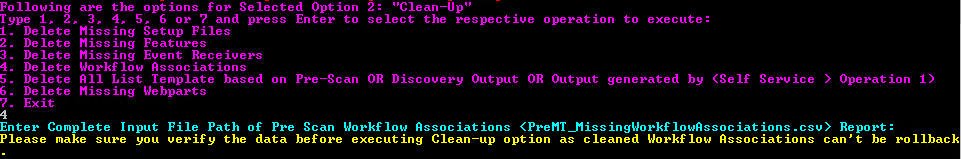 

This operation is helpful in trying to remediate the Workflow Associations report of the Pre-Migration Scan.  It attempts to remove all specified files from the target SharePoint environment.

#### Input ####
- **PreMT_MissingWorkflowAssociaitons.csv** `generated by the Pre-Migration scan`
  * This is a CSV that follows the format and content of the PreMT_MissingWorkflowAssociaitons.csv file of the Pre-Migration scan. A header row is expected with the following format:
      * *ContentDatabase, DirName, Extension, ExtensionForFile, Id, LeafName, ListId, SetupPath, SiteCollection, WebApplication, WebUrl, WFSVC_ListFile, SetupPath, SiteCollection, WebApplication, WebUrl, WFSVC_ListFile*

#### Output ####
- **DeleteWorkflowAssociations-yyyyMMdd_hhmmss.log**
	* This is the verbose log file of the scan.  
	* Success messages of interest:
		* SUCCESS: Deleted File: {0}
	* Informational messages of interest:
		* None
	* Error messages of interest:
		* Error=File Not Found
			* Cause: The specified file or folder does not exist
			* Remediation: none; the file is gone
		* Error=The file is checked out for editing
			* Cause: someone has checked out the file for editing
			* Remediation:
				* Visit the site containing the locked file
				* Undo the check-out
				* Delete the locked file
		* (404) Not Found
			* Cause: The specified site collection does not exist
			* Remediation: none; the site collection does not exist
		* Cannot contact site at the specified URL
			* Cause: The specified web (subweb, subsite, etc.) does not exist
			* Remediation: none; the web does not exist
- **DeleteWorkflowAssociations\_SuccessFailure-yyyyMMdd_hhmmss.csv**
	* In this report, details of the deleted workflow associations will be present.
	* This output file would contain the below mentioned columns and the entries corresponding to deleted workflow associations.
		* **DirName:** Specifies the directory name of the workflow associations.
		* **ExecutionDateTime:** Specifies the Executed Date & Time.
		* **LeafName:** Specifies the leaf name of the workflow associations.
		* **SiteCollection:** Specifies the Site Collection where in the workflow associations is present.
		* **WebApplication:** Specifies the Web Application of the Site Collection where in the workflow associations is present.
		* **WebUrl:** Specifies the Web Url for the Site Collection where in the workflow associations is present.
		* **Status:** Specifies whether the status of deletion of workflow associations. It contains one of the following values
			* **Success:** If value of this column is “Success” it implies that the deletion of the workflow associations was successful
			* **Failure:** If value of this column is “Failure” it implies that the deletion of the workflow associations was not successful due to some error. 

		
### 5. Delete List Templates ###
This operation reads a list of list templates having customized elements, from an input file generated by **Operation-Generate List Template Report with FTC Analysis**, or from the list templates in gallery reports generated either from PreMT or Discovery, and deletes them from the sites, webs, and lists of the target SharePoint environment.

On selecting this Operation, we get the following options as shown in the below screenshot:

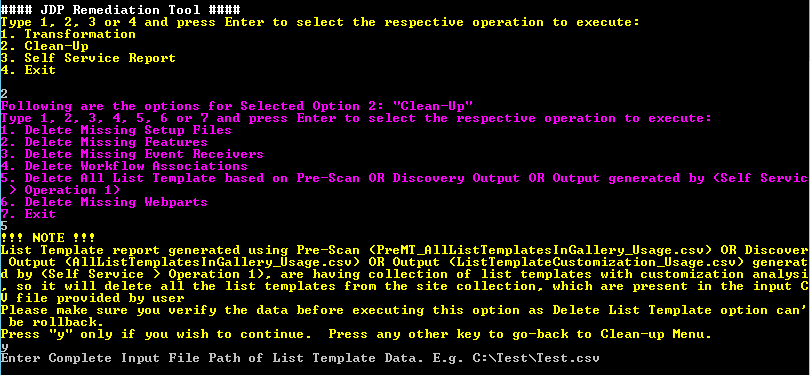 

This operation is helpful in trying to remediate the All List Templates in Gallery report of the Pre-Migration or Discovery Scan.  It attempts to remove all specified list templates from the target SharePoint environment.
 

#### Input ####

This operation reads **either** of the following input files:

- PreMT\_AllListTemplatesInGallery_Usage.csv `(generated by the Pre-Migration scan)`  
OR
- AllListTemplatesInGallery_Usage.csv `(generated by the Discovery scan) `  
OR
- ListTemplateCustomization_Usage.csv `(generated by the 'Generate List Template Report with FTC Analysis' operation of JDP Tool)`  

#### Output ####

- **DeleteListTemplates-yyyymmdd-hhhhmmss.log**
	* This is the verbose log file of the scan.  
	* Success messages of interest:
		* SUCCESS: Deleted File: {0}
	* Informational messages of interest:
		* None
	* Error messages of interest:
		* Error=File Not Found
			* Cause: The specified file or folder does not exist
			* Remediation: none; the file is gone
		* Error=The file is checked out for editing
			* Cause: someone has checked out the file for editing
			* Remediation:
				* Visit the site containing the locked file
				* Undo the check-out
				* Delete the locked file
		* (404) Not Found
			* Cause: The specified site collection does not exist
			* Remediation: none; the site collection does not exist
		* Cannot contact site at the specified URL
			* Cause: The specified web (subweb, subsite, etc.) does not exist
			* Remediation: none; the web does not exist
- **DeleteListTemplates\_SuccessFailure-yyyyMMdd_hhmmss.csv**
	* In this report, details of the deleted list templates will be present.
	* This output file would contain the below mentioned columns and the entries corresponding to deleted list templates.
		* **ExecutionDateTime:** Specifies the Executed Date & Time.
		* **ListGalleryPath:** Specifies the gallery path of the list template.
		* **ListTemplateName:** Specifies the name of the list template.
		* **SiteCollection:** Specifies the Site Collection where in the list template is present.
		* **WebApplication:** Specifies the Web Application of the Site Collection where in the list template is present.
		* **WebUrl:** Specifies the Web Url for the Site Collection where in the list template is present.
		* **Status:** Specifies whether the status of deletion of list template. It contains one of the following values
			* **Success:** If value of this column is “Success” it implies that the deletion of the list template was successful
			* **Failure:** If value of this column is “Failure” it implies that the deletion of the list template was not successful due to some error. 

### 6. Delete Missing WebParts ###
This operation reads a list of WebParts from an input file and deletes WebParts of the specified type from the sites, webs, and lists of the target SharePoint environment. 

- If the specified WebPart type is **all**, all WebParts listed in the input file are deleted
- Otherwise, only WebParts listed in the input file of the **specified type** are deleted

This operation is helpful in trying to remediate the Missing Web Parts reports.  It attempts to remove specified webparts from the target SharePoint environment.

On choosing this option, we would be asked how to proceed for this operation as shown in the below image:

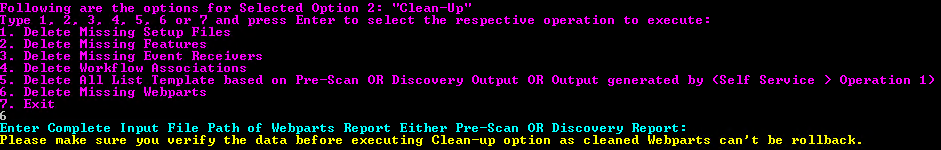

The operation also prompts the user for the following parameters:

- **WebPart Type**
	* Here we need to the give the Web Part Type that we want to delete  
	**Example:**  “WebPartType"

#### Input ####
This operation reads **either** of the following input files:

- **PreMT_MissingWebPart.csv** `(generated by the Pre-Migration scan)`  
	* This is a CSV that follows the format and content of the `PreMT_MissingWebPart.csv` file of the Pre-Migration scan. A header row is expected to have following columns
		* PageUrl, WebUrl, StorageKey, WebPartType  
**OR**

- **WebParts_Usage.csv** `(generated by the Discovery scan) `
	* This is a CSV that follows the format and content of the `WebParts_Usage.csv` file of the Discovery. A header row is expected to have following columns
		* PageUrl, WebUrl, StorageKey, WebPartType 

#### Output ####

- **DeleteWebparts\_SuccessFailure-yyyyMMdd_hhmmss.csv**
	* In this report, details of the deleted webpart will be present.
	* This output file would contain the below mentioned columns and the entries corresponding to deleted webpart.
		* **PageUrl:** Contains path of the page from list which contains the page and page name in which page webpart type is present
		*  **ExecutionDateTime:** Specifies the Executed Date & Time.
		* **StorageKey:** contains storage key of webpart on which deletion operation is performed
		* **WebpartType:** contains type of webpart on which deletion operation is performed.
		* **WebUrl:** Specifies the Web Url for the Site Collection where in webpart is present.
		* **Status:** Specifies whether the status of deletion of webpart. It contains one of the following values
			* **Success:** If value of this column is “Success” it implies that the deletion of the webpart was successful
			* **Failure:** If value of this column is “Failure” it implies that the deletion of the webpart was not successful due to some error.
- **DeleteWebparts-yyyyMMdd_hhmmss.log**
	* This is the verbose log file of the scan.  
	* Success messages of interest:
		* SUCCESS: Deleted File: {0}
	* Informational messages of interest:
		* None
	* Error messages of interest:
		* Error=File Not Found
			* Cause: The specified file or folder does not exist
			* Remediation: none; the file is gone
		* Error=The file is checked out for editing
			* Cause: someone has checked out the file for editing
			* Remediation:
				* Visit the site containing the locked file
				* Undo the check-out
				* Delete the locked file
		* (404) Not Found
			* Cause: The specified site collection does not exist
			* Remediation: none; the site collection does not exist
		* Cannot contact site at the specified URL
			* Cause: The specified web (subweb, subsite, etc.) does not exist
			* Remediation: none; the web does not exist

## 3 - Self Service Report ##
When you select the **Self-Service Reports** category, you are presented with a list of operations as shown below:

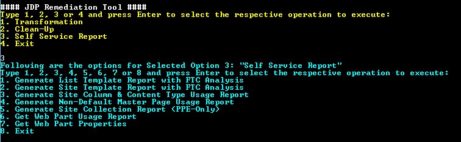 

These operations are listed below and explained in the following sections:

1. Generate List Template Report with FTC Analysis  
2. Generate Site Template Report with FTC Analysis  
3. Generate Site Column and Content Type Usage Report  
4. Generate Non-Default Master Page Usage Report  
5. Generate Site Collection Report (PPE Only)  
6. Generate Web Part Usage Report  
7. Generate Web Part Properties Report
8. Generate Security Group Report
9. Generate Pivot Reports
10. Exit

### 1. Generate List Template Report with FTC Analysis ###
This operation downloads List Templates (as directed), extracts the files from each template, and searches the files for instances of the following Customized elements: **(Content Types, Site Columns, and Event Receivers)**.

Upon choosing this option, the user is prompted for how to proceed as shown below: 

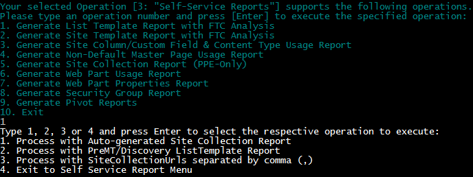

	1)	Process with Auto-generated Site Collection Report  
	2)	Process with PreMT/Discovery ListTemplate Report  
	3)	Process with SiteCollectionUrls separated by comma (,)
	4)	Exit to Self Service Report Menu

This operation is helpful in determining the customized elements present in each List Template.

There are three approaches as shown in the above figure. Please select any of following options:

1. **Process with Auto-generated Site Collection Report:**
Here, a web Application Url is provided as an input along with the Customized elements files (Content Types, Site Columns and Event Receivers) from Solution Analyzer of Discovery Tool / Or manually created files.
	> There is no need to provide PreMT-Scan or Discovery file for List Templates in Gallery components (i.e. PreMT\_AllListTemplatesInGallery\_Usage.csv or AllListTemplatesInGallery\_Usage.csv respectively)

2. **Process with PreMT/Discovery ListTemplate Report:**
Here, PreMT-Scan or Discovery file for List Templates in Gallery components (i.e. PreMT\_AllListTemplatesInGallery\_Usage.csv or AllListTemplatesInGallery\_Usage.csv respectively) is to be mandatory provided as an input along with the Customized elements files (Content Types, Site Columns and Event Receivers) from Solution Analyzer of Discovery Tool / Or manually created files.

3. **Process with SiteCollectionUrls separated by comma (,):**
Here, single Site Collection Url (or multiple site collection Urls separated by comma ‘,’) is provided as an input along with the Customized elements files (Content Types, Site Columns and Event Receivers) from Solution Analyzer of Discovery Tool / Or manually created files.
	> There is no need to provide PreMT-Scan or Discovery file for List Templates in Gallery components (i.e. PreMT\_AllListTemplatesInGallery\_Usage.csv or AllListTemplatesInGallery\_Usage.csv respectively)

#### Input ####

If Option 1 `Process with Auto-generated Site Collection Report` is selected, this operation prompts the user for following:

- Web Application Url

If Option 2 `Process with PreMT/Discovery ListTemplate Report` is selected, this operation reads **either** of the following input files:

- PreMT\_AllListTemplatesInGallery\_Usage.csv `generated by the Pre-Migration scan`
	- A header row is expected with the following format:
	- *ContentDatabase,ListGalleryPath,ListTemplateCreatedDate,ListTemplateID,ListTemplateName,SiteCollection,WebApplication,WebUrl*
- AllListTemplatesInGallery\_Usage.csv `generated by the Discovery scan`  
	- A header row is expected with the following format:
	- *ContentDatabase,ListGalleryPath,ListTemplateCreatedDate,ListTemplateID,ListTemplateName,SiteCollection,WebApplication,WebUrl*

If Option 3 `SiteCollectionUrls separated by comma (,)` is selected, this operation prompts the user for following:

- Path to file containing a comma-delimited list of one or more fully-qualified, absolute Site Collection Urls

Regardless of the option selected, the operation also reads the following input files:

- CustomFields.csv 
- EventReceivers.csv
- ContentTypes.csv

#### Output ####

- **ListTemplateCustomization_Usage.csv**
	- If customization is available in any list templates record for any component - ContentTypes, Event Receiver and Site Column, then we'll report information related to that List Template. 
	- In this report, we do not show those records where customization is not there.
	- This output file would contain the below mentioned columns and the entries corresponding to list templates.
		* **CreatedBy:** Specifies the user name.
		* **CreatedDate:** Specifies the list template created date.
		* **ModifiedBy:** Specifies the user name.
		* **ModifiedDate:** Specifies the list template modified date.
		* **ListTemplateName:** Specifies the name of the List Template.
		* **ListGalleryPath:** Specifies the List Template Gallery Path of the particular Site Collection where in the List Template is present.
		* **WebApplication:** Specifies the Web Application of the Site Collection where in the List Template is present.
		* **SiteCollection:** Specifies the Site Collection where in the List Template is present.
		* **WebUrl:** Specifies the Web Url for the Site Collection where in the List Template is present.
		* **IsCustomizationPresent:** Specifies whether there are any customized elements present in the list template.
			* **YES:** If value of this column is “YES” it implies that customization is available in this particular record, and if the value of any component (IsCustomizedContentType, IsCustomizedEventReceiver and IsCustomizedSiteColumn) of this record is “YES”, then this record's value will also be “YES”
			* **NO:** In this report, we do not show those records where customization is not there, hence the "NO" record will never appear in this column.
		* **IsCustomizedContentType:** Specifies whether there are any customized Content Types present in the List Template
			* **YES:** If value of this column is “YES” it implies that customization is available in this particular record related to Content Types
			* **NO:** If value of this column is “NO” it implies that customization is not available in this particular record related to Content Types
			* **NO INPUT FILE:** This implies that “ContentTypes.csv” file was not available in input folder or that file was not valid
		* **IsCustomizedSiteColumn:** Specifies whether there are any customized Site Columns present in the List Template
			* **YES:** If value of this column is “YES” it implies that customization is available in this particular record related to Custom Fields
			* **NO:** If value of this column is “NO” it implies that customization is not available in this particular record related to Custom Fields
			* **NO INPUT FILE:** This implies that “CustomFields.csv” file was not available in input folder or that file was not valid
		* **IsCustomizedEventReceiver:** Specifies whether there are any customized Event Receivers present in the List Template.
			* **YES:** If value of this column is “YES” it implies that customization is available in this particular record related to Event Receivers
			* **NO:** If value of this column is “NO” it implies that customization is not available in this particular record related to Event Receivers
			* **NO INPUT FILE:** This implies that “EventReceivers.csv” file was not available in input folder or that file was not valid
		* **CTHavingCustomEventReceiver:** Lists out the Names of Content Types with ‘;’ separated values, which are having the custom Event Receivers present in them. If no Custom Event Receivers is present, then ‘N/A’ would be displayed.

- **SiteCollections.txt** `(generated only for Option 1 Process with Auto-generated Site Collection Report)`
	- This is file will list all the Site Collections that will be processed for the Web Application Url.
- **DownloadAndModifyListTemplate-yyyymmdd-hhhhmmss.log**
	* This is the verbose log file of the scan.  
	* Success messages of interest:
		* None
	* Informational messages of interest:
		* None
	* Error messages of interest:
		* Error=File Not Found
			* Cause: The specified file or folder does not exist
			* Remediation: none; the file is gone
		* Error=The file is checked out for editing
			* Cause: someone has checked out the file for editing
			* Remediation:
				* Visit the site containing the locked file
				* Undo the check-out
				* Delete the locked file
		* (404) Not Found
			* Cause: The specified site collection does not exist
			* Remediation: none; the site collection does not exist
		* Cannot contact site at the specified URL
			* Cause: The specified web (subweb, subsite, etc.) does not exist
			* Remediation: none; the web does not exist

> **Note:** 
> If any of the input files *(ContentTypes.csv, CustomFields.csv, EventReceivers.csv)* are not present in the specified input folder, or a given file has no entries, the operation will not be able to search the list templates for the corresponding custom elements.
> 
> **Example:** If user has provided only *ContentTypes.csv and CustomFields.csv* in input folder, and *EventReceivers.csv* is not present, the *isCustomEventReceiver* column of the report will have a value of `NO INPUT FILE`. 

### 2. Generate Site Template Report with FTC Analysis ###
This operation downloads Site Templates (as directed), extracts the files from each template, and searches the files for instances of the following Customized elements: **(Content Types, Site Columns, Features, and Event Receivers)**. 

Upon choosing this option, the user is prompted for how to proceed as shown below:

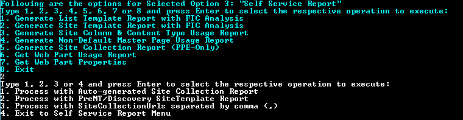

	1)	Process with Auto-generated Site Collection Report  
	2)	Process with PreMT/Discovery SiteTemplate Report  
	3)	Process with SiteCollectionUrls separated by comma (,)
	4)	Exit to Self Service Report Menu

This operation is helpful in determining the customized elements present in each Site Template.

There are three approaches as shown in the above figure. Please select any of following options:

1. **Process with Auto-generated Site Collection Report:**
Here, a web Application Url is provided as an input along with the Customized elements files (Content Types, Site Columns, Features and Event Receivers) from Solution Analyzer of Discovery Tool / Or manually created files.
 
	> There is no need to provide PreMT-Scan or Discovery file for Site Templates in Gallery components (i.e. PreMT\_AllSiteTemplatesInGallery\_Usage.csv or AllSiteTemplatesInGallery\_Usage.csv respectively)

2. **Process with PreMT/Discovery SiteTemplate Report:**
Here, PreMT-Scan or Discovery file for Site Templates in Gallery components (i.e. PreMT\_AllSiteTemplatesInGallery\_Usage.csv or AllSiteTemplatesInGallery\_Usage.csv respectively) is to be mandatorily provided as an input along with the Customized elements files (Content Types, Site Columns, Features and Event Receivers) from Solution Analyzer of Discovery Tool / Or manually created files. 

3. **Process with SiteCollectionUrls separated by comma (,):**
Here, single Site Collection Url (or multiple site collection Urls separated by comma ‘,’) is provided as an input along with the Customized elements files (Content Types, Site Columns, Features and Event Receivers) from Solution Analyzer of Discovery Tool / Or manually created files. 

	> There is no need to provide PreMT-Scan or Discovery file for Site Templates in Gallery components (i.e. PreM\T_AllSiteTemplatesInGallery\_Usage.csv or AllSiteTemplatesInGallery\_Usage.csv respectively)

#### Input ####

- Web Application Url `(Mandatory for Option 1, not for other Options)`
- Single or Multiple Site Collection Urls `(Mandatory for Option 3, not for other Options)`
- PreMT\_AllSiteTemplatesInGallery\_Usage.csv `(Mandatory for Option 2, not for other Options)`	
	OR    
AllSiteTemplatesInGallery\_Usage.csv `(Mandatory for Option 2, not for other Options)`
- ContentTypes.csv `(Mandatory for all Options)`
- CustomFields.csv `(Mandatory for all Options)`
- EventReceivers.csv `(Mandatory for all Options)`
- Features.csv `(Mandatory for all Options)`

#### Output ####

- **SiteTemplateCustomization_Usage.csv**
	- If customization is available in any site templates record for any component - Features, ContentTypes, Event Receiver and Site Column, then we'll report information related to that Site Template. 
	- In this report, we do not show those records where customization is not there.
	- This output file would contain the below mentioned columns and the entries corresponding to site templates.
		* **CreatedBy:** Specifies the user name.
		* **CreatedDate:** Specifies the site template created date.
		* **ModifiedBy:** Specifies the user name.
		* **ModifiedDate:** Specifies the site template modified date.
		* **SiteTemplateName:** Specifies the name of the site template.
		* **SiteTemplateGalleryPath:** Specifies the Site Template Gallery Path of the particular Site Collection where in the Site Template is present.
		* **WebApplication:** Specifies the Web Application of the Site Collection where in the Site Template is present.
		* **SiteCollection:** Specifies the Site Collection where in the Site Template is present.
		* **WebUrl:** Specifies the Web Url for the Site Collection where in the Site Template is present.
		* **IsCustomizationPresent:** Specifies whether there are any customized elements present in the site template.
			* **YES:** If value of this column is “YES” it implies that customization is available in this particular record, and if the value of any component (IsCustomizedFeature, IsCustomizedContentType, IsCustomizedEventReceiver and IsCustomizedSiteColumn) of this record is “YES”, then this record's value will also be “YES”
			* **NO:** In this report, we do not show those records where customization is not there, hence the "NO" record will never appear in this column.
		* **IsCustomizedContentType:** Specifies whether there are any customized Content Types present in the Site Template
			* **YES:** If value of this column is “YES” it implies that customization is available in this particular record related to Content Types
			* **NO:** If value of this column is “NO” it implies that customization is not available in this particular record related to Content Types
			* **NO INPUT FILE:** This implies that “ContentTypes.csv” file was not available in input folder or that file was not valid
		* **IsCustomizedSiteColumn:** Specifies whether there are any customized Site Columns present in the Site Template
			* **YES:** If value of this column is “YES” it implies that customization is available in this particular record related to Custom Fields
			* **NO:** If value of this column is “NO” it implies that customization is not available in this particular record related to Custom Fields
			* **NO INPUT FILE:** This implies that “CustomFields.csv” file was not available in input folder or that file was not valid
		* **IsCustomizedEventReceiver:** Specifies whether there are any customized Event Receivers present in the Site Template.
			* **YES:** If value of this column is “YES” it implies that customization is available in this particular record related to Event Receivers
			* **NO:** If value of this column is “NO” it implies that customization is not available in this particular record related to Event Receivers
			* **NO INPUT FILE:** This implies that “EventReceivers.csv” file was not available in input folder or that file was not valid
		* **IsCustomizedFeature:** Specifies whether there are any customized Feature present in the Site Template.
			* **YES:** If value of this column is “YES” it implies that customization is available in this particular record related to Feature
			* **NO:** If value of this column is “NO” it implies that customization is not available in this particular record related to Feature
			* **NO INPUT FILE:** This implies that “Features.csv” file was not available in input folder or that file was not valid
		* **CTHavingCustomEventReceiver:** Lists out the Names of Content Types with ‘;’ separated values, which are having the custom Event Receivers present in them. If no Custom Event Receivers is present, then ‘N/A’ would be displayed.

- **SiteCollections.txt** `(Output for only Option 1)`
	- This is file will list all the Site Collections that will be processed for the Web Application Url.
- **DownloadAndModifySiteTemplate-yyyymmdd-hhhhmmss.log**
	* This is the verbose log file of the scan.  
	* Success messages of interest:
		* None
	* Informational messages of interest:
		* None
	* Error messages of interest:
		* Error=File Not Found
			* Cause: The specified file or folder does not exist
			* Remediation: none; the file is gone
		* Error=The file is checked out for editing
			* Cause: someone has checked out the file for editing
			* Remediation:
				* Visit the site containing the locked file
				* Undo the check-out
				* Delete the locked file
		* (404) Not Found
			* Cause: The specified site collection does not exist
			* Remediation: none; the site collection does not exist
		* Cannot contact site at the specified URL
			* Cause: The specified web (subweb, subsite, etc.) does not exist
			* Remediation: none; the web does not exist

> **Note:** 
> If any of the input files *(Features.csv, ContentTypes.csv, CustomFields.csv, EventReceivers.csv)* are not present in the specified input folder, or if a given file has no entries, the operation will not be able to search the site templates for the corresponding custom elements.
> 
> **Example:** If user has provided only *Features.csv, ContentTypes.csv and CustomFields.csv* in the input folder, and *EventReceivers.csv* is not present, the *isCustomEventReceiver* column of the report will have a value of `NO INPUT FILE`. 

### 3. Generate Site Column & Content Type Usage Report ###
This operation reads a list of site collection Urls from an input file and scans each site collection. It reports any web or list that is using either a custom Content Type or custom Site Column of interest.  It also reports any local Content Type that has been derived from a custom Content Type of interest.  

This report is helpful in trying to remediate the Missing Content Type and Missing Site Column reports.  This report tells you where within each site collection that the content types and site columns are still in use. 

**General Remediation:**  

- Visit the affected site collection
- If the data associated with these instances is still needed, migrate it to new content types and site columns, or move it into a spreadsheet.
- Delete all instances and empty BOTH recycle bins. 
- Clean up the definitions themselves via a temporary Sandbox Solution that uses the original Feature ID to re-deploy ONLY the affected content types and site columns.  
- Simply activate, then de-activate, the temporary sandbox feature to remove the definitions. 
- If the definitions remain, you still have some instances to delete.

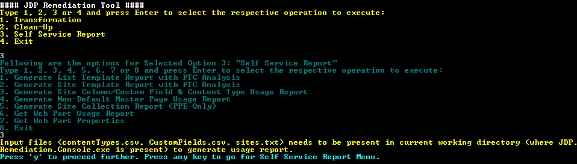

#### Input ####
**1) Sites.txt**

  * This is NOT a CSV file, so no header row expected
  * Each line of this file should contain a fully-qualified, absolute site collection URL.
  * In general, this should contain the list of site collections identified in the following files of the Pre-Migration Scan:
	- PreMT_MissingSiteColumn.csv
	- PreMT_MissingContentType.csv
  * Avoid duplicate entries

**2) CustomFields.csv**

  * The file defines the custom Site Columns of interest.
  * This is a CSV that follows the format and content of the 'CustomFields.csv' file of the Discovery Tool Solution Analyzer scan.  A header row is expected with the following format: *ID, Name*	
  
	- **ID:**
      * This column should contain the GUID of the site column,
          * Take this value from the **CustomFields.csv** file or **PreMT_MissingSiteColumn.csv**
	- **Name**
      * This column should contain the display name of the site column
          * Take this value from the **CustomFields.csv** file  or **PreMT_MissingSiteColumn.csv**

 **3) ContentTypes.csv**

  * The file defines the custom Content Types of interest.
  * This is a CSV that follows the format and content of the **PreMT_MissingContentType.csv** file of the Pre-Migration scan. A header row is expected with the following format:
      * ContentTypeId, ContentTypeName
  * **ContentTypeId**
      * This column should contain the ID of the content type
          * Take this value from the **PreMT_MissingContentType.csv** file or **ContentTypes.csv** from Solution Analyzer
  * **ContentTypeName**
      * This column should contain the display name of the content type
          * Take this value from the **PreMT_MissingContentType.csv** file or **ContentTypes.csv** from Solution Analyzer
  * This operation is compatible with Pre-Migration Scan report **PreMT_MissingContentType.csv** and Discovery Tool scan report **ContentType_Usage.csv**, as well
 
#### Output ####

- **SiteColumnORFieldAndContentTypeUsage-yyyyMMdd_hhmmss.csv**
  * In this report, details of the custom Content Types and Site Columns/Custom Fields usage will be present.
  * This output file would contain the below mentioned columns and the entries corresponding to custom content types and site columns/custom fields.
	  * **ComponentName:** Specifies whether it is Content Types or Site Columns/Custom Fields.
	  * **ListId:** Specifies the Id of the List associated.
	  * **ListTitle:** Specifies the Title of the List associated.
	  * **ContentTypeOrCustomFieldId:** Specifies the Id of the Content Type or Site Column/Custom Field.
	  * **ContentTypeOrCustomFieldName:** Specifies the Name of the Content Type or Site Column/Custom Field.
	  * **WebUrl**: Specifies the Web Url for the Site Collection where content types and site columns/custom fields are present.
- **GenerateColumnAndTypeUsageReport-yyyyMMdd_hhmmss.log**
  * This is the verbose log file of the scan.
  * Success messages of interest:
      * FOUND: Site Column [{1}] on WEB: {0}
      * FOUND: Site Column [{2}] on LIST [{0}] of WEB: {1}
      * FOUND: Content Type [{1}] on WEB: {0}
      * FOUND: Child Content Type [{2}] of [{1}] on WEB: {0}
      * FOUND: Content Type [{2}] on LIST [{0}] of WEB: {1}
      * FOUND: Child Content Type [{3}] of [{2}] on LIST [{0}] of WEB: {1}
  * Informational messages of interest:
      * None
  * Error messages of interest:
      * None
    
### 4. Generate Non-Default Master Page Usage Report ###
This operation reads a list of site collection Urls from an input file and scans each site collection. It reports those webs that are using a non-default SP2013 Master Page (i.e., something other than `“seattle.master”`) as either its System (MasterUrl) or Site (CustomMasterUrl) Master Page.  

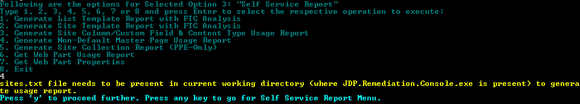

> **Note:**
> 
> If both Master Page settings (**CustomMasterUrl** and **MasterUrl**) are **“Seattle.master”**, no records are displayed for the web in the output usage file.
> 
> If either Master Page setting (**CustomMasterUrl** or **MasterUrl**) is **“Seattle.master”**, a corresponding record is displayed for the web in the output usage file.

#### Input ####
- **Sites.txt**
  * This is NOT a CSV file, so no header row expected
  * Each line of this file should contain a fully-qualified, absolute site collection URL.
  * Avoid duplicate entries

#### Output ####

- **NonDefaultMasterPageUsage-yyyyMMdd_hhmmss.csv**
  * In this report, details of the non-default SP2013 Master Pages.
  * This output file would contain the below mentioned columns and the entries corresponding to non-default SP2013 Master Pages.
	  * **CustomMasterUrl:** Specifies Custom Master Url of the Master Page.
	  * **MasterUrl:** Specifies the Master Url of the Master Page.
	  * **SiteCollection:** Specifies the Url of the Site Collection of the Master Page.
	  * **WebUrl:** Specifies the Web Url of the Master Page.

- **GenerateNonDefaultMasterPageUsageReport-yyyyMMdd_hhmmss.log**
  * This is the verbose log file of the scan.
  * Success messages of interest:
      * FOUND: System Master Page setting (Prop=MasterUrl) of web {0} is {1}
      * FOUND: Site Master Page setting (Prop=CustomMasterUrl) of web {0} is {1}
  * Informational messages of interest:
      * None
  * Error messages of interest:
      * None
### 5. Generate Site Collection Report (PPE-Only) ###
This operation reports all site collections found across all web applications in the target farm.  

On choosing this option, we would be asked how to proceed for this operation as shown below 

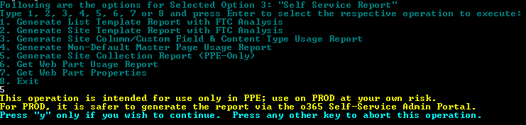

#### Input ####
This operation does not use an input files; instead, it prompts the user for the following parameters:

- the fully-qualified, absolute URL of an existing site collection in the target farm

#### Output ####
- **GenerateSiteCollectionReport-yyyyMMdd_hhmmss.txt**
  * This is NOT a CSV file, so no header row generated
  * Each line of the file will contain a fully-qualified, absolute site collection URL.
- **SiteCollectionReport- yyyyMMdd_hhmmss.txt**
	* It gives the site collections in all the web applications.
	* Each line of the file will contain a fully-qualified, absolute site collection URL.
- **SiteCollectionsReport- yyyyMMdd_hhmmss.csv**
	* In this report, details of all site collections found across all web applications in the target farm will be present.
	* This output file would contain the below mentioned columns and the entries corresponding all site collections.
		* **SiteCollectionUrl:** Specifies the Url of the site collection.

> **NOTES:**
> This operation is intended for use only in PPE; use on PROD at your own risk.  For PROD, it is safer to generate the report via the o365 Self-Service Admin Portal.
> 
> This operation leverages the Search Index; as such, it might take up to 20-minutes for a newly-created site to appear in the report. 

### 6. Generate Web Part Usage Report ###

This operation iterates through all Pages present in the *“root folder”*, the *“Pages”* library, and the *“Site Pages”* library of the given web and reports the usage of the given Web Part.

#### Input ####
This operation does not use an input file; instead, it prompts the user for the following parameters: 

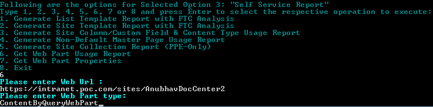

- **Web Url:**
	* Here we need to provide the Web Url  
	**Example:**    “https://intranet.campoc.com/sites/OffshorePoc"
- **WebPart Type:**
	* Here we need to provide the WebPart Type for which we need usage report  
	**Example:**    “ContentEditorWebPart”

#### Output ####
- **WebPartUsage-yyyyMMdd_hhmmss.csv**
  * In this report, we’ll get the Usage report of Web Parts in the farm.
  * This output file would contain the below mentioned columns and the entries corresponding to list templates.
  		* **PageUrl:** Specifies the Url of the page where the web part is present.
  		* **WebUrl:** Specifies the Web Url for the Site Collection where in the WebPart is present.
  		* **WebPartId:** Specifies Web Part Id of the web part
  		* **WebPartTitle:** Specifies the Web Part title of the web part
  		* **WebPartType:** Specifies the Web Part Type of the web part
  		* **ZoneIndex:** Specifies the Zone Index of the web part  	
- **WebPartUsage-yyyyMMdd_hhmmss.log**
	* This is the verbose log file of the scan.  
	* Success messages of interest:
		* INFO: [GetWebPartUsage_DefaultPages] Finding WebPartUsage details for Web Part: {<WebPartType>} in Web: {WebUrl}
	* Informational messages of interest:
		* None
	* Error messages of interest:
		* Error=File Not Found
			* Cause: The specified file or folder does not exist
			* Remediation: none; the file is gone
		* Error=The file is checked out for editing
			* Cause: someone has checked out the file for editing
			* Remediation:
				* Visit the site containing the locked file
				* Undo the check-out
				* Delete the locked file
		* (404) Not Found
			* Cause: The specified site collection does not exist
			* Remediation: none; the site collection does not exist
		* Cannot contact site at the specified URL
			* Cause: The specified web (subweb, subsite, etc.) does not exist
			* Remediation: none; the web does not exist

### 7. Generate Web Part Properties Report ###

This operation will Returns the properties of the given Web Part in Xml format.

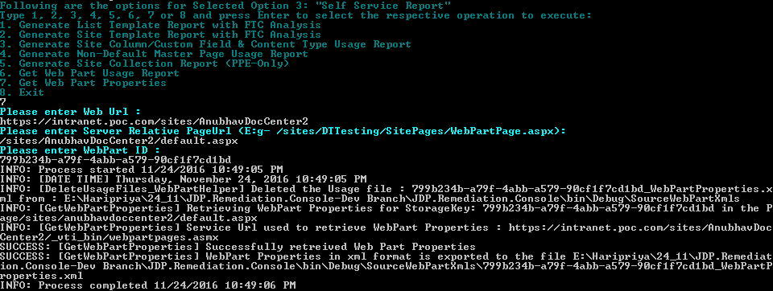

#### Input ####
This operation does not use an input file; instead, it prompts the user for the following parameters: 

- **Web Url:**
	* Here we need to provide the Web Url where WebPart is present  
	**Example:**    “https://intranet.campoc.com/sites/OffshorePoc"
- **Server Relative PageUrl:**
	* Here we need to provide the server relative url of the page in Web Url where   WebPart is present  
	**Example:**    “/sites/OffshorePoc/SitePages/DevHome.aspx”
- **WebPart ID:**
	* Here we need to provide the WebPartID or StorageKey of web part  
	**Example:**    “de5c57f9-7991-4ba7-b141-9db5d48393fc"

#### Output ####
- **WebPartID(provided in input)_WebPartProperties.xml**
  * Creates Property Xml file for the corresponding Web Part. This file will be available inside SourceWebPartXmls Folder.   
  **Example**: 799b234b-a79f-4abb-a579-90cf1f7cd1bd_WebPartProperties.xml 	
- **WebpartProperties-yyyyMMdd_hhmmss.log**
	* This is the verbose log file of the scan.  
	* Success messages of interest:
		* WebPart Properties in xml format is exported to the file {0}
	* Informational messages of interest:
		* None
	* Error messages of interest:
		* Error=File Not Found
			* Cause: The specified file or folder does not exist
			* Remediation: none; the file is gone
		* Error=The file is checked out for editing
			* Cause: someone has checked out the file for editing
			* Remediation:
				* Visit the site containing the locked file
				* Undo the check-out
				* Delete the locked file
		* (404) Not Found
			* Cause: The specified site collection does not exist
			* Remediation: none; the site collection does not exist
		* Cannot contact site at the specified URL
			* Cause: The specified web (subweb, subsite, etc.) does not exist
			* Remediation: none; the web does not exist

### 8. Generate Security Group Report ###
This operation reads a list of site collection URLs from an input file and scans each site collection. It reports those site collections that have granted permissions to one or more Security Groups of interest.

**Input**

This operation reads the following input files:

- Sites.txt (no header; one fully-qualified, absolute site collection Url per line)
- SecurityGroups.txt (no header; one security group per line in the following format: ***domain\groupName***)

**Output**

This operation generates the following output files:

- GenerateSecurityGroupReport-yyyyMMdd\_hhmmss.csv
- GenerateSecurityGroupReport-yyyyMMdd\_hhmmss.log (verbose log file)

### 9. Generate Pivot Reports ###
This operation generates an excel report which contains all the details about the input CSV data (Pre-Migration Report and Discovery Usage Reports), with graphical representation using pivot table and slicers in excel sheet. 

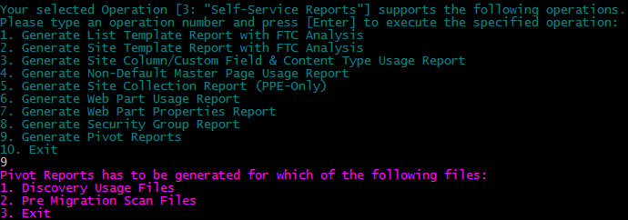

This operation reads any input file (.csv format) and shows the data present in it in a user-friendly manner using the features of Excel such as pivot, graph (pie chart or bar chart or etc..), filter, slicer, summary, and count of any specific data by using any specific condition. 

Upon choosing this option, the user is prompted for how to proceed as shown below:

	1)	Discovery Usage Files  
	2)	PreMigration Scan Files  

This operation is helpful in showing the customized elements present in each Reports in pivot view and graphical representation.

**Input**

If **Option 1** `Discovery Usage Files` is selected, this operation prompts the user for following:

- Complete Path of Discovery Usage Report/Files

The following Discovery Usage Files needs to be present in the provided path or folder. If any file is not present then Pivot view not be created for that file or component. 

**Discovery Usage Files/Reports (CSV)**

- AllListTemplatesInGallery_Usage.csv
- AllSiteTemplatesInGallery_Usage.csv
- AllContentTypeEventReceivers_Usage.csv
- ContentType_Usage.csv
- CTFixDefinitionNULL_Usage.csv
- CThavingFeatureIDTag\_Definition_Usage.csv
- CustomFields_Usage.csv
- MasterPage_Usage.csv
- CustomWorkflows_Usage.csv
- EventReceivers_Usage.csv
- Features_Usage.csv
- GhostedCustomFields_Usage.csv
- ListTemplates_Usage.csv
- PageLayouts\_AvailableCustomPageLayout_Usage.csv
- PageLayouts\_CustomPageLayOutUsageInPages_Usage.csv
- SandBoxSolSaveAsTemplate_Usage.csv
- SandboxSolutions_Usage.csv
- SiteDefinitions_Usage.csv
- WebParts_Usage.csv

**Discovery-Pivot.xml (mandatory)**
> This file should be present in the above provided path. This XML having the xml tags for all Discovery Reports.
> 
> This XML file is present in the path: [Discovery-Pivot.xml](/JDP%20Remediation%20-%20CSOM/JDP.Remediation.Console/JDP.Remediation.Console/XMLs/Discovery-Pivot.xml)
> 

If **Option 2** `Pre Migration Scan Files` is selected, this operation prompts the user for following:

- Complete Path of Discovery Usage Report/Files

The following Pre Migration Scan Files needs to be present in the provided path or folder. If any file is not present then Pivot view not be created for that file or component. 

**Pre Migration Scan Files/Reports (CSV)**

- PreMT\_AllContentTypeEventReceivers_Usage.csv
- PreMT\_AllListTemplatesInGallery_Usage.csv
- PreMT\_AllSiteTemplatesInGallery_Usage.csv
- PreMT\_CThavingFeatureIDTag_Definition.csv
- PreMT\_MissingAssembly.csv
- PreMT\_MissingConfigDBFeatures.csv
- PreMT\_MissingContentType.csv
- PreMT\_MissingFeature.csv
- PreMT\_MissingFieldTypes.csv
- PreMT\_MissingLists.csv
- PreMT\_MasterPage_Usage.csv
- PreMT\_MissingSetupFile.csv
- PreMT\_MissingSiteColumn.csv
- PreMT\_MissingSiteDefinition.csv
- PreMT\_MissingWebPart.csv
- PreMT\_MissingWorkflowAssociations.csv

**PreMT-Pivot.xml (mandatory)**
> This file should be present in the above provided path. This XML having the xml tags for all Pre Migration Reports.
> 
> This XML file is present in the path: [PreMT-Pivot.xml](/JDP%20Remediation%20-%20CSOM/JDP.Remediation.Console/JDP.Remediation.Console/XMLs/PreMT-Pivot.xml)
> 

**Output**

These operations generates the following output files:

`Output of Option 1 operation`

- DiscoveryPivotReport.xlsx 
- DT_GeneratePivotReport-yyyyMMdd\_hhmmss.log (verbose log file)

`Output of Option 2 operation`

- PreMT_PivotReport.xlsx
- PreMT_GeneratePivotReport-yyyyMMdd\_hhmmss.log (verbose log file)

This operation shows the data in a user-friendly manner using the features of Excel such as pivot, graph (pie chart or bar chart or etc..), filter, slicer, summary, and count of any specific data by using any specific condition. 

> **Example 1:** 

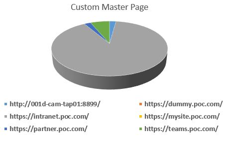

> **Example 2:**
 
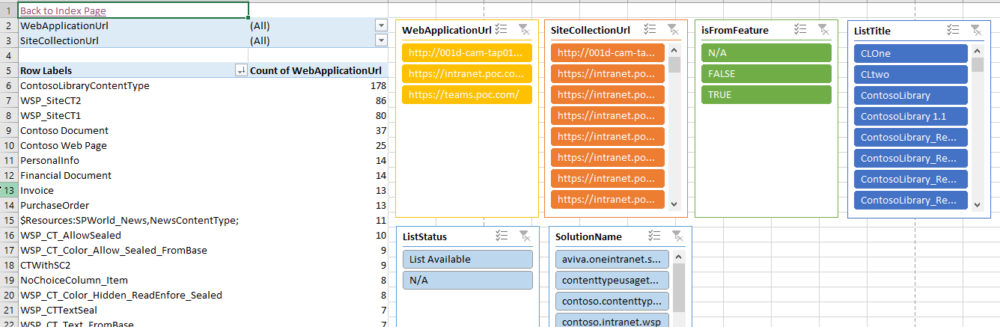

 

 

