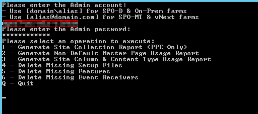

# Introduction #
This is a client-side Console application that leverages the v15 CSOM client SDKs to perform operations against a remote SPO-D 2013 farm.  

The primary purpose of this tool is to allow a customer to remediate issues identified in Setup files, Features and Event Receivers, also provides usage report of Master Pages, Custom Fields and Content Types.  

Following operations can be performed using this application:  
1 Generate Site Collection Report (PPE-Only)  
2 Generate Non-Default Master Page Usage Report  
3 Generate Site Column & Content Type Usage Report  
4 Delete Missing Setup Files  
5 Delete Missing Features  
6 Delete Missing Event Receivers   
Q Quit

 

As soon as you run this application, you would need to provide some inputs to execute this console application to get your desired results.

- You will have to provide Admin account details- ***User Name*** and ***Password***
- You will also have to select the corresponding selection of the operation you want to perform.
**Example**, if you want to execute *"Delete Missing features"*, you'll have to enter 5 and enter Q to *quit* the application.

This application logs all exceptions if any occur while execution. This console application is intended to work against SPO-D 2013 (v15) target environments.  

Please find below more details on these functionalities, which have been implemented in this application:  

## 1. Generate Site Collection Report (PPE Only) ##
This operation generates a text file containing a list of all site collections found across all web applications in the target farm.  
 
This functionality does not use any input file and generates result in output text format. If at any time the details/report of all the Site Collection of any farm are required, using this functionality will give the desired output - ***GenerateSiteCollectionReport-yyyyMMdd_hhmmss.txt*** (verbose log file).

## 2. Generate Non-Default Master Page Usage Report ##
This operation reads a list of site collection URLs from an input file and scans each site collection, looking for any web that is using a non-default SP2013 Master Page (i.e., something other than “seattle.master”) as either its System or Site master page.  

This functionality reads an input file (Sites.txt), which contains a fully-qualified, absolute site collection URL. Generates result in output file - ***GenerateNonDefaultMasterPageUsageReport -yyyyMMdd_hhmmss.log*** (verbose log file).

## 3. Generate Site Column & Content Type Usage Report ##
This operation reads a list of site collection URLs from an input file and scans each site collection, looking for any web or list that is using either a custom Content Type or custom Site Column of interest.  It also looks for local Content Types that have been derived from the custom Content Types of interest.  

This report is helpful in trying to remediate the Missing Content Type and Missing Site Column reports.  This report tells you where within each site collection that the content types and site columns are ***still in use***.  

This functionality reads an input file (Sites.txt, SiteColumns.csv and ContentTypes.csv). Generates result in output file - ***GenerateColumnAndTypeUsageReport-yyyyMMdd_hhmmss.log*** (verbose log file).

## 4. Delete Missing Setup Files ##
This operation reads a list of setup file definitions from an input file and deletes the associated setup file from the target SharePoint environment.  

This operation is helpful in trying to remediate the Missing Setup Files reports.  It attempts to remove all specified setup files from the target SharePoint environment.  

This functionality reads an input file in CSV format, which should contain header columns like - *ContentDatabase, SetupFileDirName, SetupFileExtension, SetupFileName, SetupFilePath, SiteCollection, UpgradeStatus, WebApplication, WebUrl*. Generates result in output file - ***DeleteMissingSetupFiles-yyyyMMdd_hhmmss.log*** (verbose log file).

## 5. Delete Missing Features ##
This operation reads a list of feature definitions from an input file and deletes the associated feature from the webs and sites of the target SharePoint environment.  

This operation is helpful in trying to remediate the Missing Feature reports.  It attempts to remove all specified features from the target SharePoint environment.  

This functionality reads an input file in CSV format, which should contain header columns like - *ContentDatabase, FeatureId, FeatureTitle, SiteCollection, Source, UpgradeStatus, WebApplication, WebUrl*. Generates result in output file - ***DeleteMissingFeatures-yyyyMMdd_hhmmss.log*** (verbose log file).

## 6. Delete Missing Event Receivers ##
This operation reads a list of event receiver definitions from an input file and deletes the associated event receiver from the sites, webs, and lists of the target SharePoint environment.  

This operation is helpful in trying to remediate the Missing Event Receiver reports.  It attempts to remove all specified event receivers from the target SharePoint environment.  

This functionality reads an input file in CSV format, which should contain header columns like - *Assembly, ContentDatabase, EventName, HostId, HostType, SiteCollection, WebApplication, WebUrl*. Generates result in output file - ***DeleteMissingEventReceivers-yyyyMMdd_hhmmss.log*** (verbose log file).
