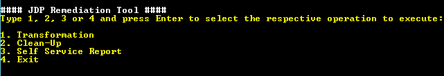
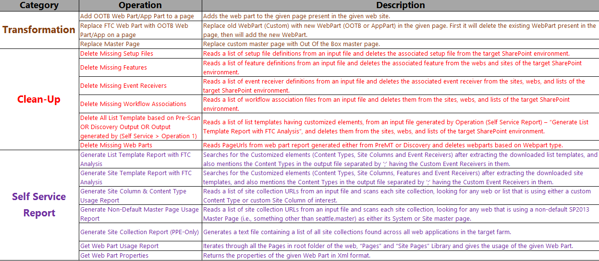
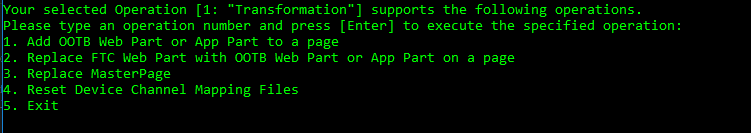
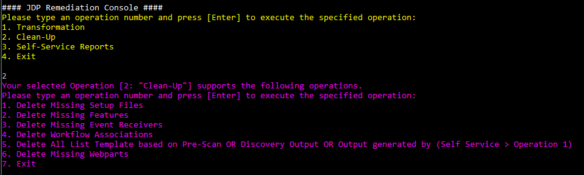
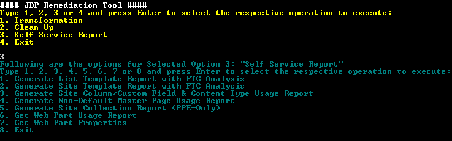
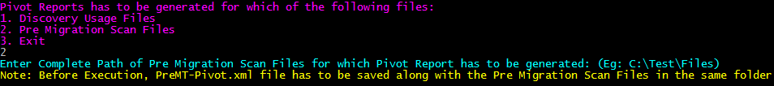

# JDP Remediation - CSOM #

### Summary ###
This sample demonstrates the JDP Remediation Console, which is a CSOM-based Windows Console application that can assist an overall effort to remove Farm Solution-based customizations and components from a SharePoint farm.  It allows the user to perform operations from the following general categories:

-  **Transformation**
	- Transform site collections to remove and/or replace various Farm Solution-based customizations and components within the target SharePoint farm prior to Farm Solution retraction
-  **Clean-up**
	- Remove various Farm Solution-based customizations and components that have been left behind (i.e., orphaned) within the target SharePoint farm after Farm Solution retraction
-  **Self-Service Reporting** 
	- Generate various reports to locate Farm Solution-based customizations and components within the target SharePoint farm

### Applies to ###
-  Office 365 Dedicated (D)
-  SharePoint 2013 on-premises

### Solution ###
Solution | Author(s)
---------|----------
JDP Remediation - CSOM | Infosys Ltd, Ron Tielke (**Microsoft**)

### Version history ###
Version  | Date | Comments
---------| -----| --------
1.0  | January 29th 2016 | Initial release

### Disclaimer ###
**THIS CODE IS PROVIDED *AS IS* WITHOUT WARRANTY OF ANY KIND, EITHER EXPRESS OR IMPLIED, INCLUDING ANY IMPLIED WARRANTIES OF FITNESS FOR A PARTICULAR PURPOSE, MERCHANTABILITY, OR NON-INFRINGEMENT.**

----------

# Introduction #
This is a client-side Console application that leverages the v15 CSOM client SDKs to perform operations against a remote SPO-D 2013 farm.  

The purpose of this tool is to allow a customer to clean up issues identified by Setup file, Feature, and Event Receiver scans, transform existing site collections to remove dependencies on various custom components such as Master Pages and Web Parts, and generate usage reports for custom components such as Master Pages, Custom Fields, and Content Types.  

When you start this application, you are prompted to provide Admin account credentials (***User Name*** and ***Password***)

You are then presented with a list of Operation Categories as shown below:
    
	1. Transformation  
	2. Clean-Up  
	3. Self-Service Reports 
	4. Exit  

 

Simply select the category of the operation you want to perform.

**Examples**:

- To execute `"Clean-Up"` operations, enter **2**.
- To `"Exit"` the application, enter **4**.

This application logs all exceptions that occur during its execution. This application is intended to work against SPO-D 2013 (v15) target environments.  

The following is a summary of each category of operations supported by this application.

 

The following sections provide details on each category and operation supported by this application.

## 1 - Transformation ##
When you select the **Transformation** category, you are presented with a list of operations as shown below:

 

These operations are listed below and explained in the following sections:

1. Add OOTB Web Part/App Part to a page 
2. Replace FTC Web Part with OOTB Web Part/App Part on a page 
3. Replace Master Page  
4. Reset Device Channel Mapping Files
5. Manage [Add|Remove] Maintenance Banners
6. Exit

### 1. Add OOTB Web Part or App Part to a page ###
This operation adds a specified WebPart (OOTB or AppPart) to a specified page present in the specified web site.

**Input**

This operation does not use an input file; instead, it prompts the user for the following parameters: 

- WebUrl
- ServerRelativePageUrl
- WebPartZoneIndex
- WebPartZoneID
- WebPartFileName
- WebPartXmlFilePath

**Output**

This operation generates the following output files:
 
- AddWebPart\_SuccessFailure-yyyyMMdd\_hhmmss.csv
- AddWebPart-yyyyMMdd\_hhmmss.log (verbose log file) 

### 2. Replace FTC Web Part with OOTB Web Part or App on a page ###

This operation reads an input file and replaces existing WebParts (Custom) with new WebParts (OOTB or AppPart) on the specified pages.  Operationally, it deletes an existing WebPart before adding the new WebPart. 

**Input**

This operation reads **either** of the following input files:

- PreMT\_MissingWebPart.csv `generated by the Pre-Migration scan`
	- A header row is expected with the following format: 
	- *WebPartId, WebPartType, PageUrl, StorageKey, ZoneID, ZoneIndex, WebUrl*
- WebPartsUsage\_Usage.csv `generated by the Discovery scan` 
	- A header row is expected with the following format: 
	- *WebPartId, WebPartType, PageUrl, StorageKey, ZoneID, ZoneIndex, WebUrl*

The operation also prompts the user for the following parameters:

- Input File Path
- WebPartType
- Target WebPart File Name
- WebPartXmlFilePath.

**Output**

This operation generates the following output files:

- ReplaceWebPart\_SuccessFailure-yyyyMMdd\_hhmmss.csv 
- ReplaceWebPart-yyyyMMdd\_hhmmss.log (verbose log file)

### 3. Replace MasterPage ###

This operation reads an input file (or user input) to obtain a list of one or more WebUrls.  It then examines the Master Page settings (*Site Master Page*, *System Master Page*, or *Both*) of each web and replaces settings that reference the user-specified custom master page with settings that reference the user-specified OOTB master page.  

Upon choosing this option, the user is prompted for how to proceed as shown below: 

	1)	Process with Input file  
	2)	Process for Web Url

**Input**

If Option 1 `Process with Input file` is selected, this operation reads **either** of the following input files:

- PreMT\_MasterPage\_Usage.csv  `generated by the Pre-Migration scan`
	- A header row is expected to have following columns:
	- *PageUrl, SiteCollection, WebUrl, MasterUrl, CustomMasterUrl*
- MasterPage\_Usage.csv `generated by the Discovery scan`
	- A header row is expected to have following columns:
	- *PageUrl, SiteCollection, WebUrl, MasterUrl, CustomMasterUrl*

If Option 2 `Process for Web Url` is selected, this operation prompts the user for the following parameters:

- WebUrl

Regardless of the option selected, the operation also prompts the user for the Master Page setting(s) to replace:

- The Site (aka CustomMasterUrl) Master Page only
- The System (aka MasterUrl) Master Page only
- Both the Site and System Master Pages

As each WebUrl is processed, the operation also prompts the user for the following:

- The custom Master Page file to be replaced
- The OOTB Master Page file to use as the replacement

**Output**

This operation generates the following output files:

- ReplaceMasterPage\_SuccessFailure- yyyyMMdd\_hhmmss.csv
- ReplaceMasterPage-yyyyMMdd\_hhmmss.log (verbose log)

### 4. Reset Device Channel Mapping Files ###

This operation reads a list of "locked" custom master pages from an input file. It then updates the Device Channel Mappings file of the web that contains the master page file to ensure all references to the custom master page have been removed.  Each reference in the mapping file is reset to use the name of the Site Master Page currently in use on the web.

- **Note:** this operation also saves a backup of the original Mappings file.

This operation is helpful in trying to remediate the Missing Setup Files reports, especially when trying to delete custom master pages from a Master Page Gallery.  Even though all webs of the target SharePoint environment may have been reset to use OOTB master pages (e.g., seattle.master), initial attempts to delete custom master page files will often fail with the following error:

- This item cannot be deleted because it is still referenced by other pages

This error typically occurs because the Device Channel Mappings file of the web still holds a reference to the custom master page file. 

Use the **PreMT\_MissingSetupFile.csv** file generated by the Pre-Migration scan as a basis of the input file for this operation; simply copy/include only those rows that refer to master page files that cannot be deleted.

**Input**

This operation reads the following input files:
 
- LockedMasterPageFiles.csv `filtered version of PreMT_MissingSetupFile.csv file generated by the Pre-Migration scan`
	- A header row is expected with the following format: 
	- *ContentDatabase, SetupFileDirName, SetupFileExtension, SetupFileName, SetupFilePath, SiteCollection, UpgradeStatus, WebApplication, WebUrl*

**Output**

This operation generates the following output files:

- ResetDeviceChannelMappingFiles-yyyyMMdd\_hhmmss.csv
- ResetDeviceChannelMappingFiles-yyyyMMdd\_hhmmss.log (verbose log file)

### 5. Manage [Add|Remove] Maintenance Banners ###

This operation reads a list of site collection Urls from an input file and performs the specified Maintenance Banner Operation [Add or Remove] on each site collection.

Upon choosing this option, the user is prompted for how to proceed as shown below:

	1)	Add Maintenance Banner to Sites  
	2)	Remove Maintenance Banner from Sites  
	3)	Exit to Transformation Menu

This operation is helpful in alerting site collection users to the fact that important maintenance activities are either in progress or upcoming. 

The operation leverages a centrally-managed maintenance banner message that is contained in the `embedMaintenanceBanner.js` file.  Before executing this operation, you should edit this file to specify the desired message.  Do not change the name of this file.

See [embedMaintenanceBanner.js](/JDP%20Remediation%20-%20CSOM/JDP.Remediation.Console/JDP.Remediation.Console/Scripts/embedMaintenanceBanner.js) for an example of this file. Use of this file results in a sample banner as shown below:
 

Be sure to upload the file to a centrally-managed library, typically a folder (e.g., `scripts` or `js`) that resides beneath the `Style Library` of your root portal site.  You will be prompted for the Url of this folder if you select the **Add** operation.

**Input**

If Option 1 `Add Maintenance Banner to Sites` is selected, this operation prompts the user for the following parameters:

- CDN Library Folder Url
	- The absolute Url of the CDN Library Folder that contains the following JS file: embedMaintenanceBanner.js 
	- Example: [https://portal.contoso.com/style library/cdn/scripts](https://portal.contoso.com/style%20library/cdn/scripts)

Regardless of the option selected, the operation also reads the following input files:

- Sites.txt (no header; one fully-qualified, absolute site collection Url per line)

**Output**

This operation generates the following output files:

- ManageMaintenanceBanners-yyyyMMdd\_hhmmss.csv
- ManageMaintenanceBanners-yyyyMMdd\_hhmmss.log (verbose log file)

## 2 - Clean-Up ##
When you select the **Clean-up** category, you are presented with a list of operations as shown below:

 

These operations are listed below and explained in the following sections:

1. Delete Missing Setup Files  
2. Delete Missing Features  
3. Delete Missing Event Receivers  
4. Delete Workflow Associations  
5. Delete List Templates  
6. Delete Missing WebParts  
7. Exit 

### 1. Delete Missing Setup Files ###
This operation reads a list of setup file definitions from an input file and deletes the associated setup files from the target SharePoint environment.  

This operation is helpful in trying to remediate the Missing Setup Files reports.  It attempts to remove all specified setup files from the target SharePoint environment.  

**Input**

This operation reads the following input files:
 
- PreMT\_MissingSetupFile.csv `generated by the Pre-Migration scan`
	- A header row is expected with the following format: 
	- *ContentDatabase, SetupFileDirName, SetupFileExtension, SetupFileName, SetupFilePath, SiteCollection, UpgradeStatus, WebApplication, WebUrl*

**Output**

This operation generates the following output files:

- DeleteSetupFiles\_SuccessFailure-yyyyMMdd\_hhmmss.csv
- DeleteSetupFiles-yyyyMMdd\_hhmmss.log (verbose log file)

### 2. Delete Missing Features ###
This operation reads a list of feature definitions from an input file and deletes the associated features from the sites and webs of the target SharePoint environment.  

This operation is helpful in trying to remediate the Missing Feature reports.  It attempts to remove all specified features from the target SharePoint environment.  

**Input**

This operation reads **either** of the following input files:

- PreMT\_MissingFeature.csv `generated by the Pre-Migration scan`
	- A header row is expected with the following format: 
	- *ContentDatabase, FeatureId, FeatureTitle, SiteCollection, Source, UpgradeStatus, WebApplication, WebUrl*
- Features\_Usage.csv `generated by the Discovery scan` 
	- A header row is expected with the following format: 
	- *ContentDatabase, FeatureId, FeatureTitle, SiteCollection, Source, UpgradeStatus, WebApplication, WebUrl*

**Output**

This operation generates the following output files:

- DeleteFeatures\_SuccessFailure-yyyyMMdd\_hhmmss.csv
- DeleteFeatures-yyyyMMdd\_hhmmss.log (verbose log file)

### 3. Delete Missing Event Receivers ###
This operation reads a list of event receiver definitions from an input file and deletes the associated event receivers from the sites, webs, and lists of the target SharePoint environment.  

This operation is helpful in trying to remediate the Missing Event Receiver reports.  It attempts to remove all specified event receivers from the target SharePoint environment.  

**Input**

This operation reads **either** of the following input files:

- PreMT\_MissingEventReceiver.csv `generated by the Pre-Migration scan`
	- A header row is expected with the following format: 
	- *Assembly, ContentDatabase, EventName, HostId, HostType, SiteCollection, WebApplication, WebUrl*
- EventReceivers\_Usage.csv `generated by the Discovery scan`
	- A header row is expected with the following format: 
	- *Assembly, ContentDatabase, EventName, HostId, HostType, SiteCollection, WebApplication, WebUrl*

**Output**

This operation generates the following output files:

- DeleteEventReceivers\_SuccessFailure-yyyyMMdd\_hhmmss.csv
- DeleteEventReceivers-yyyyMMdd\_hhmmss.log (verbose log file)

### 4. Delete Workflow Associations ###

This operation reads a list of workflow associations from an input file and deletes the workflow associations from the sites, webs, and lists of the target SharePoint environment.

This operation is helpful in trying to remediate the Workflow Associations report of the Pre-Migration Scan.  It attempts to remove all specified files from the target SharePoint environment.

**Input**

This operation reads the following input file:

- PreMT\_MissingWorkflowAssociations.csv `generated by the Pre-Migration scan`
	- A header row is expected with the following format:
	- *ContentDatabase, DirName, Extension, ExtensionForFile, Id, LeafName, ListId, SetupPath, SiteCollection, WebApplication, WebUrl, WFSVC\_ListFile,SetupPath, SiteCollection, WebApplication, WebUrl, WFSVC\_ListFile*

**Output**

This operation generates the following output files:

- DeleteWorkflowAssociations\_SuccessFailure-yyyyMMdd\_hhmmss.csv
- DeleteWorkflowAssociations-yyyyMMdd\_hhmmss.log (verbose log file)

### 5. Delete List Templates ###

This operation reads a list of list templates having customized elements from an input file and deletes the list templates from the sites, webs, and lists of the target SharePoint environment.

This operation is helpful in trying to remediate the All List Templates in Gallery report of the Pre-Migration or Discovery Scan.  It attempts to remove all specified list templates from the target SharePoint environment.

**Input**

This operation reads **either** of the following input files:

- PreMT\_AllListTemplatesInGallery\_Usage.csv `generated by the Pre-Migration scan`
	- A header row is expected with the following format:
	- *ContentDatabase,ListGalleryPath,ListTemplateCreatedDate,ListTemplateID,ListTemplateName,SiteCollection,WebApplication,WebUrl*
- AllListTemplatesInGallery\_Usage.csv `generated by the Discovery scan`  
	- A header row is expected with the following format:
	- *ContentDatabase,ListGalleryPath,ListTemplateCreatedDate,ListTemplateID,ListTemplateName,SiteCollection,WebApplication,WebUrl*
- ListTemplateCustomization\_Usage.csv `generated by the 'Generate List Template Report with FTC Analysis' operation`
	- A header row is expected with the following format:
	- *ContentDatabase,ListGalleryPath,ListTemplateCreatedDate,ListTemplateID,ListTemplateName,SiteCollection,WebApplication,WebUrl*

**Output**

This operation generates the following output files:

- DeleteListTemplates\_SucessFailure-yyyyMMdd\_hhmmss.csv
- DeleteListTemplates-yyyyMMdd\_hhmmss.log (verbose log file)

### 6. Delete Missing WebParts ###
This operation reads a list of WebParts from an input file and deletes WebParts of the specified type from the sites, webs, and lists of the target SharePoint environment. 

- If the specified WebPart type is **all**, all WebParts listed in the input file are deleted
- Otherwise, only WebParts listed in the input file of the **specified type** are deleted

This operation is helpful in trying to remediate the Missing Web Parts reports.  It attempts to remove specified webparts from the target SharePoint environment.  

**Input**

This operation reads **either** of the following input files:

- PreMT\_MissingWebParts.csv `generated by the Pre-Migration scan`  
	- A header row is expected with the following format:
	- *PageUrl, WebUrl, StorageKey, WebPartType*
- WebParts\_Usage.csv `generated by the Discovery scan`
	- A header row is expected with the following format:
	- *PageUrl, WebUrl, StorageKey, WebPartType*

The operation also prompts the user for the following parameters:

- WebPartType

**Output**

This operation generates the following output files:

- DeleteWebparts\_SuccessFailure-yyyyMMdd\_hhmmss.csv
- DeleteWebparts-yyyyMMdd\_hhmmss.log (verbose log file)

## 3 - Self-Service Reports ##
When you select the **Self-Service Reports** category, you are presented with a list of operations as shown below:

 

These operations are listed below and explained in the following sections:

1. Generate List Template Report with FTC Analysis  
2. Generate Site Template Report with FTC Analysis  
3. Generate Site Column and Content Type Usage Report  
4. Generate Non-Default Master Page Usage Report  
5. Generate Site Collection Report (PPE Only)  
6. Generate Web Part Usage Report  
7. Generate Web Part Properties Report
8. Generate Security Group Report
9. Generate Pivot Reports
10. Exit

### 1. Generate List Template Report with FTC Analysis ###
This operation downloads List Templates (as directed), extracts the files from each template, and searches the files for instances of the following Customized elements: **(Content Types, Site Columns, and Event Receivers)**. 

Upon choosing this option, the user is prompted for how to proceed as shown below:

	1)	Process with Auto-generated Site Collection Report  
	2)	Process with PreMT/Discovery ListTemplate Report  
	3)	Process with SiteCollectionUrls separated by comma (,)

This operation is helpful in determining the customized elements present in each List Template.

**Input**

If Option 1 `Process with Auto-generated Site Collection Report` is selected, this operation prompts the user for following:

- Web Application Url

If Option 2 `Process with PreMT/Discovery ListTemplate Report` is selected, this operation reads **either** of the following input files:

- PreMT\_AllListTemplatesInGallery\_Usage.csv `generated by the Pre-Migration scan`
	- A header row is expected with the following format:
	- *ContentDatabase,ListGalleryPath,ListTemplateCreatedDate,ListTemplateID,ListTemplateName,SiteCollection,WebApplication,WebUrl*
- AllListTemplatesInGallery\_Usage.csv `generated by the Discovery scan`  
	- A header row is expected with the following format:
	- *ContentDatabase,ListGalleryPath,ListTemplateCreatedDate,ListTemplateID,ListTemplateName,SiteCollection,WebApplication,WebUrl*

If Option 3 `SiteCollectionUrls separated by comma (,)` is selected, this operation prompts the user for following:

- Path to file containing a comma-delimited list of one or more fully-qualified, absolute Site Collection Urls

Regardless of the option selected, the operation also reads the following input files:

- CustomFields.csv 
- EventReceivers.csv
- ContentTypes.csv

**Output**

This operation generates the following output files:

- SiteCollections.txt `(generated only for Option 1 Process with Auto-generated Site Collection Report)`
- ListTemplateCustomization\_Usage.csv
- DownloadAndModifyListTemplate-*yyyymmdd*-*hhhhmmss*.log (verbose log)

> **Note:** 
> If any of the input files *(ContentTypes.csv, CustomFields.csv, EventReceivers.csv)* are not present in the specified input folder, or a given file has no entries, the operation will not be able to search the list templates for the corresponding custom elements.
> 
> **Example:** If user has provided only *ContentTypes.csv and CustomFields.csv* in input folder, and *EventReceivers.csv* is not present, the *isCustomEventReceiver* column of the report will have a value of `NO INPUT FILE`. 

### 2. Generate Site Template Report with FTC Analysis ###
This operation downloads Site Templates (as directed), extracts the files from each template, and searches the files for instances of the following Customized elements: **(Content Types, Site Columns, Features, and Event Receivers)**. 

Upon choosing this option, the user is prompted for how to proceed as shown below:

	1) Process with Auto-generated Site Collection Report  
	2) Process with PreMT/Discovery SiteTemplate Report  
	3) Process with SiteCollectionUrls separated by comma (,)

This operation is helpful in determining the customized elements present in each Site Template.

**Input**

This operation reads the following input files, based on the selected option:

- Web Application Url `(Mandatory for Option 1, not for other Options)`
- Single or Multiple Site Collection Urls `(Mandatory for Option 3, not for other Options)`
- PreMT\_AllSiteTemplatesInGallery\_Usage.csv `(Mandatory for Option 2, not for other Options)` 
OR  
- AllSiteTemplatesInGallery\_Usage.csv `(Mandatory for Option 2, not for other Options)`
- ContentTypes.csv `(Mandatory for all Options)`
- CustomFields.csv `(Mandatory for all Options)`
- EventReceivers.csv `(Mandatory for all Options)`
- Features.csv `(Mandatory for all Options)`

**Output**

This operation generates the following output files:

- SiteCollections.txt `(Output for only Option 1)`
- SiteTemplateCustomization\_Usage.csv
- DownloadAndModifySiteTemplate-yyyymmdd-hhhhmmss.log (verbose log)

> **Note:** 
> If any of the input files *(Features.csv, ContentTypes.csv, CustomFields.csv, EventReceivers.csv)* are not present in the specified input folder, or if a given file has no entries, the operation will not be able to search the site templates for the corresponding custom elements.
> 
> **Example:** If user has provided only *Features.csv, ContentTypes.csv and CustomFields.csv* in the input folder, and *EventReceivers.csv* is not present, the *isCustomEventReceiver* column of the report will have a value of `NO INPUT FILE`. 

### 3. Generate Site Column & Content Type Usage Report ###
This operation reads a list of site collection Urls from an input file and scans each site collection. It reports any web or list that is using either a custom Content Type or custom Site Column of interest.  It also reports any local Content Type that has been derived from a custom Content Type of interest.  

This report is helpful in trying to remediate the Missing Content Type and Missing Site Column reports.  This report tells you where within each site collection that the content types and site columns are still in use.  

**Input**

This operation reads the following input files:

- Sites.txt (no header; one fully-qualified, absolute site collection Url per line)
- CustomFields.csv
	- A header row is expected with the following format:
	- *ID,Name*
- ContentTypes.csv
	- A header row is expected with the following format:
	- *ContentTypeID,ContentTypeName*

**Output**

This operation generates the following output files:

- SiteColumnORFieldAndContentTypeUsage- yyyyMMdd\_hhmmss.csv
- GenerateColumnAndTypeUsageReport-yyyyMMdd\_hhmmss.log (verbose log file)

### 4. Generate Non-Default Master Page Usage Report ###
This operation reads a list of site collection Urls from an input file and scans each site collection. It reports those webs that are using a non-default SP2013 Master Page (i.e., something other than `“seattle.master”`) as either its System (MasterUrl) or Site (CustomMasterUrl) Master Page.  

> **Note:**
> 
> If both Master Page settings (**CustomMasterUrl** and **MasterUrl**) are **“Seattle.master”**, no records are displayed for the web in the output usage file.
> 
> If either Master Page setting (**CustomMasterUrl** or **MasterUrl**) is **“Seattle.master”**, a corresponding record is displayed for the web in the output usage file.

**Input**

This operation reads the following input files:

- Sites.txt (no header; one fully-qualified, absolute site collection Url per line)

**Output**

This operation generates the following output files:

- NonDefaultMasterPageUsage- yyyyMMdd\_hhmmss.csv
- GenerateNonDefaultMasterPageUsageReport -yyyyMMdd\_hhmmss.log (verbose log file)

### 5. Generate Site Collection Report (PPE Only) ###
This operation reports all site collections found across all web applications in the target farm.  
 
**Input**

This operation does not use an input files; instead, it prompts the user for the following parameters:

- the fully-qualified, absolute URL of an existing site collection in the target farm

**Output**

This operation generates the following output files:

- SiteCollectionReport-yyyyMMdd\_hhmmss.txt
- GenerateSiteCollectionReport-yyyyMMdd\_hhmmss.log (verbose log file)

### 6. Generate Web Part Usage Report ###
This operation iterates through all Pages present in the *“root folder”*, the *“Pages”* library, and the *“Site Pages”* library of the given web and reports the usage of the given Web Part.
 
**Input**

This operation does not use an input file; instead, it prompts the user for the following parameters: 

- WebUrl 
- WebPartType

**Output**

This operation generates the following output files:

- WebPartUsage-yyyyMMdd\_hhmmss.csv
- WebPartUsage-yyyyMMdd\_hhmmss.log (verbose log file)

### 7. Generate Web Part Properties Report ###
This operation reports the properties of the given Web Part in Xml format.
 
**Input**

This operation does not use an input file; instead, it prompts the user for the following parameters: 

- WebUrl
- ServerRelativePageUrl
- WebPartID

**Output**

This operation generates the following output files:

- WebPartID(*provided in input*)\_WebPartProperties.xml
- WebpartProperties-yyyyMMdd\_hhmmss.log (verbose log file)

### 8. Generate Security Group Report ###
This operation reads a list of site collection URLs from an input file and scans each site collection. It reports those site collections that have granted permissions to one or more Security Groups of interest.

**Input**

This operation reads the following input files:

- Sites.txt (no header; one fully-qualified, absolute site collection Url per line)
- SecurityGroups.txt (no header; one security group per line in the following format: ***domain\groupName***)

**Output**

This operation generates the following output files:

- GenerateSecurityGroupReport-yyyyMMdd\_hhmmss.csv
- GenerateSecurityGroupReport-yyyyMMdd\_hhmmss.log (verbose log file)

### 9. Generate Pivot Reports ###
This operation generates an excel report which contains all the details about the input CSV data (Pre-Migration Report and Discovery Usage Reports), with graphical representation using pivot table and slicers in excel sheet. 

This operation reads any input file (.csv format) and shows the data present in it in a user-friendly manner using the features of Excel such as pivot, graph (pie chart or bar chart or etc..), filter, slicer, summary, and count of any specific data by using any specific condition. 

Upon choosing this option, the user is prompted for how to proceed as shown below:

	1)	Discovery Usage Files  
	2)	PreMigration Scan Files  

This operation is helpful in showing the customized elements present in each Reports in pivot view and graphical representation.

**Input**

If **Option 1** `Discovery Usage Files` is selected, this operation prompts the user for following:

 

- Complete Path of Discovery Usage Report/Files

The following Discovery Usage Files needs to be present in the provided path or folder. If any file is not present then Pivot view not be created for that file or component. 

**Discovery Usage Files/Reports (CSV)**

- AllListTemplatesInGallery_Usage.csv
- AllSiteTemplatesInGallery_Usage.csv
- AllContentTypeEventReceivers_Usage.csv
- ContentType_Usage.csv
- CTFixDefinitionNULL_Usage.csv
- CThavingFeatureIDTag\_Definition_Usage.csv
- CustomFields_Usage.csv
- MasterPage_Usage.csv
- CustomWorkflows_Usage.csv
- EventReceivers_Usage.csv
- Features_Usage.csv
- GhostedCustomFields_Usage.csv
- ListTemplates_Usage.csv
- PageLayouts\_AvailableCustomPageLayout_Usage.csv
- PageLayouts\_CustomPageLayOutUsageInPages_Usage.csv
- SandBoxSolSaveAsTemplate_Usage.csv
- SandboxSolutions_Usage.csv
- SiteDefinitions_Usage.csv
- WebParts_Usage.csv

**Discovery-Pivot.xml (mandatory)**
> This file should be present in the above provided path. This XML having the xml tags for all Discovery Reports.
> 
> This XML file is present in the path: [Discovery-Pivot.xml](/JDP%20Remediation%20-%20CSOM/JDP.Remediation.Console/JDP.Remediation.Console/XMLs/Discovery-Pivot.xml)
> 

If **Option 2** `Pre Migration Scan Files` is selected, this operation prompts the user for following:

 

- Complete Path of Discovery Usage Report/Files

The following Pre Migration Scan Files needs to be present in the provided path or folder. If any file is not present then Pivot view not be created for that file or component. 

**Pre Migration Scan Files/Reports (CSV)**

- PreMT\_AllContentTypeEventReceivers_Usage.csv
- PreMT\_AllListTemplatesInGallery_Usage.csv
- PreMT\_AllSiteTemplatesInGallery_Usage.csv
- PreMT\_CThavingFeatureIDTag_Definition.csv
- PreMT\_MissingAssembly.csv
- PreMT\_MissingConfigDBFeatures.csv
- PreMT\_MissingContentType.csv
- PreMT\_MissingFeature.csv
- PreMT\_MissingFieldTypes.csv
- PreMT\_MissingLists.csv
- PreMT\_MasterPage_Usage.csv
- PreMT\_MissingSetupFile.csv
- PreMT\_MissingSiteColumn.csv
- PreMT\_MissingSiteDefinition.csv
- PreMT\_MissingWebPart.csv
- PreMT\_MissingWorkflowAssociations.csv

**PreMT-Pivot.xml (mandatory)**
> This file should be present in the above provided path. This XML having the xml tags for all Pre Migration Reports.
> 
> This XML file is present in the path: [PreMT-Pivot.xml](/JDP%20Remediation%20-%20CSOM/JDP.Remediation.Console/JDP.Remediation.Console/XMLs/PreMT-Pivot.xml)
> 

**Output**

These operations generates the following output files:

`Output of Option 1 operation`

- DiscoveryPivotReport.xlsx 
- DT_GeneratePivotReport-yyyyMMdd\_hhmmss.log (verbose log file)

`Output of Option 2 operation`

- PreMT_PivotReport.xlsx
- PreMT_GeneratePivotReport-yyyyMMdd\_hhmmss.log (verbose log file)

 

